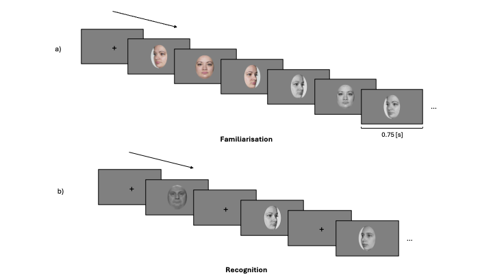
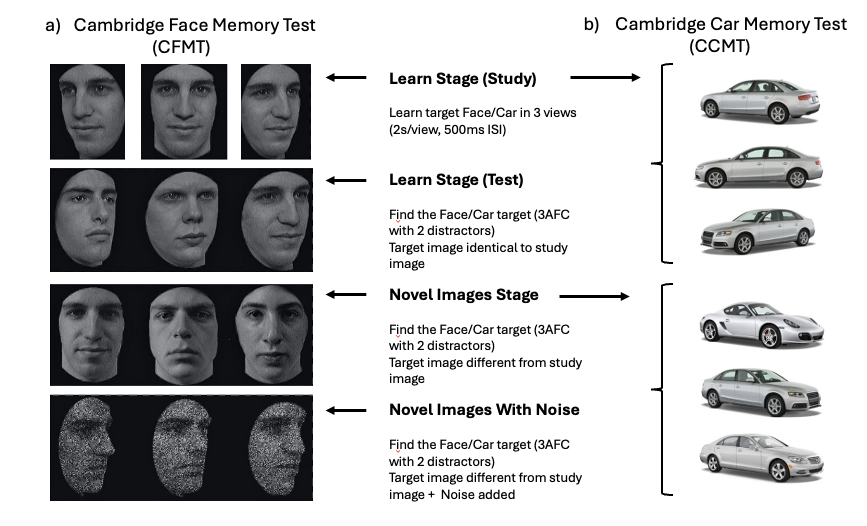

```{r}
#| label: setup
#| include: false

pkgs <- c(
  "tidyverse", "RColorBrewer", "patchwork", "paletteer", "here", "EMC2", 
  "tidybayes", "tinytable", "osfr", "svglite"
)
vapply(
  pkgs, library, logical(1),
  character.only = TRUE, logical.return = TRUE
)

knitr::opts_chunk$set(echo = FALSE)

theme_set(
  theme_bw() +
    theme(text = element_text(size = 15, face = "bold"), 
          title = element_text(size = 15, face = "bold"),
          legend.position = "none")
)
## plot settings ##
## Plot colors
safe_pal <- paletteer_d("rcartocolor::Safe", 4)

myColors_3 <- c(
  "novel"   = safe_pal[1],
  "learned" = safe_pal[2]
)

# Subsets for single-experiment plots if still needed
myColors_1 <- myColors_3[c("novel", "learned")]

## Set the amount of dodge in figures
pd <- position_dodge(0.7)
pd2 <- position_dodge(1)
```



# Introduction

Paragraph 1: general comment on face recognition and on the important variability in the “normal” population • Face recognition: importance in daily life/ real-life tasks from eye-witness identification to passport control (for example).
• Variability in the population in face recognition ability.
Prosopagnosia or super recognizers example (ref: Noyes, Phillips, & O’Toole, 2017 for super recognizers/Kress & Daum, 2003 for prosopagnosia patients), but even in the normal population (Burton, White, McNeill., 2016; Dowsett & Burton, 2015; White et al., 2014), more specifically for tasks involving unfamiliar faces.

Paragraph 2: past investigation of individual difference in face identity processing • Investigating individual differences in face identity processing: often measured by different tests.
Examples: Cambridge Face Memory test (CFMT) = New face learning / Glasgow Face Matching Test (GFMT): unfamiliar face perception / before They Were Famous task: Familiar face perception -\> (McCaffery et al., 2018).
These scores are then correlated between them or with different behavioural or physiological measures to assess the strength of the relationship between them.
• Description of some results here

Paragraph 3: Investigating individual differences in latent processes using computational approaches • Behavioural measures remain distant proxies of underlying cognitive processes, thus not ideal for capturing individual differences in these processes (Haines et al., 2020) + make interpretation more errors prone (ex: Ratcliff et al., 2010) -\> more cautious, not because better processing.
Problem: how to disentangle multiple components of a process.\
• One potential alternative: using computational approaches.
Advantage of model-based analysis of individual difference: fitting data from individual participants to disentangle the effects of the different processes driving behaviour.
Cleaner measures of the processes of interest and could enhance our understanding how variation in these latent, unobserved processes arise across individuals (White, Curl & Sloane., 2016).
Example with Ratcliff (2010) and White et al. (2014).

Paragraph 4: building upon our past project results summary and application of individual differences in face recognition ability • Past study: we used hierarchical model fitting of evidence-accumulation models to model choice-rt in a face memory old/new task (see figure LBA) -\> better evidence of accumulation for detecting novel faces that recognizing visually learned faces.
Novelty pop-out effect of novel faces.
Increased threshold as well for novel faces (need more evidence to committing to the novel response compared to the learned one).
Using this computational approach, we found that distinct computational processes involved in the decision-making of face recognition are affected by face familiarity.
We also found inter-subject variability in the estimated parameters.
• Question: are these parameters linked to individual face recognition ability?
Does face recognition ability predict the estimation of these parameters?
• Help us understanding what do these parameters reflect, from where this inter-subject variability comes from and how specific the inferences that we can make about them are related to the face recognition ability.
• Possibility that the variation observed in these parameters reflect a general recognition ability, unspecific to faces.

Paragraph 5: Short description of how we are going to address the questions • How will we do it: estimation of parameter from a face memory task, followed by two Memory ability scores: Cambridge Face Memory Test (CFMT) and Cambridge Car Memory Test (CCMT).

# Method and Materials

## Pre-registration and open science

We report how we determined our sample size, all data exclusions (if any), all manipulations, and all measures in the study (simonsConstraintsGeneralityCOG2017).
The research question, hypotheses, experimental design, planned analysis, and exclusion criteria were preregistered (Experiment: link OSF).
The raw data, experimental materials, and analysis code are available on GitHub (link) or the Open Science Framework (link).

```{r}
#| label: exclusion-all
#| include: false

data <- read_csv(here::here("data/data.csv"))

exclusions <- read_csv(here::here("data/exclusion.csv"))

# ── Extract scalars for inline text ──────────────────────────────────────────
completed <- as.integer(exclusions$n_removed[exclusions$stage == "1"] + exclusions$n_remain[exclusions$stage == "1"])
exclude_missed_trials <- as.integer(exclusions$n_removed[exclusions$stage == "1"])
exclude_rt <- as.integer(exclusions$n_removed[exclusions$stage == "2"])
exclude_acc <- as.integer(exclusions$n_removed[exclusions$stage == "3a"])
final <- as.integer(exclusions$n_remain[exclusions$stage == "3a"])
```

```{r}
#| label: demographics-all
#| include: false

demo <- read_csv(here("data/demo.csv"))

# ── Extract scalars for inline text ──────────────────────────────────────────
male <- as.integer(sum(demo$Sex == "Male"))
female <- as.integer(sum(demo$Sex == "Female"))
mean_age = as.numeric(round(mean(demo$Age), 1))
sd_age = as.numeric(round(sd(demo$Age), 1))
min_age = as.numeric(min(demo$Age))
max_age = as.numeric(max(demo$Age))
```

## Participants

All participant were recruited on the Prolific platform (<https://www.prolific.com>).
Participants had to be located in the United Kingdom or in the United States, be aged between 18-65 years old, with normal or corrected-to-normal vision and speak fluent English.
Furthermore, Prolific offers the option to chose the approval rate of the participants willing to take part in the study.
The approval rate is the percentage for which participants has been approved in previous experiment.
An approval rating between 95% and 100% was chosen in our study to try to ensure high data quality.
`r completed` participants completed the experiment.
Following our preregistered exclusion criterion, `r exclude_missed_trials` participants were excluded because their percentage of missed trials was higher than 40%, `r exclude_rt` because their percentage of RT outside the established range (0.2 to 2 seconds) were higher than 25% and `r exclude_acc` were removed because the overall accuracy was lower than 55%.
In the end, data from `r final` participants (`r male` men and `r female` women) were retained for the analysis and the LBA modeling.
Ages ranged from `r min_age` to `r max_age` ($M_{age} =$ `r mean_age`, $SD_{age} =$ `r sd_age`).
Following Prolific payment principles, each participant received 9£ for the completion of the study.
This experiment was accepted by the ethics committee of the Federal Institute of technology (ETH) Zurich.

## Material

Participant were asked to complete the study using a desktop computer.
Beforehand, the paradigm was tested on three different operative systems (PC, Macintosh and Linux) and on three web browsers (Google Chrome, Safari and Firefox).
Participant were aware that using any other combination of operative systems and web browsers might lead to the inability to complete the experiment and were asked to follow these directives to ensure a consistent procedure and participant experience.

## Procedure

The experiment was divided into three experimental tasks.
A face recognition task was used to estimate the LBA parameters from manifest measures (accuracy and response times).
Face and car recognition ability were assessed using the Cambridge Face Memory Test and the Cambridge Car Memory Test.
Participants always first underwent the face recognition task and the order of two memory tests was counterbalanced.

### Face recognition task

The face recognition task was divided into two distinct parts: a familiarization part and a recognition part.
During the familiarization part, unknown identities were presented on the screen and participants were instructed to memorize the identity of the faces.
One familiarization trial consisted of the presentation of 6 face images, one after the other, showing the same identity but varying in viewing points (3/4 left view, frontal view and 3/4 right view) and the colorimetry (colorful image, gray scale image).
The duration of each image presentation was set to 0.75 second and each participant underwent 30 familiarization trials (for 30 unknown identities).
During the familiarization, we introduced catch trials to ensure participants attention.
After some familiarization trials, a gray scale image of a person's face was presented on the screen.
Participants were asked to press the "q" key if the face belonged to the last seen identity or the "p" key if it was not.
The faces seen during the familiarization were considered the "Learned faces" within-subject condition.

In the recognition part, participants completed three blocks of 90 recognition trials.
Each block was separated from another by a short break.
Half of the trials were learned identities trials and the other half were new, previously unseen identities trials.
In each trial, a gray scale image of a face was shown on the screen.
Participants were asked to choose if they had previously seen this face in the familiarization part or not.
If they did, the should press the "q" key and if they did not, the "p" key.
Participants were asked to respond as quickly and accurately as possible.
It is important to note that participants never saw two pictures of the same learned identity in the same block and never saw the same picture (3/4 left view, frontal view, or 3/4 right view) of a learned identity during the entire recognition part.
Furthermore, each novel identity was only presented once in the entire recognition part.
Response time \[s\] and accuracy were collected after each recognition trial.
A response time limit of 2 seconds has been set for each recognition trial.
If participants took longer than 2 seconds to press a response key, the text "Too late!" appeared in red on the screen and the trial was discarded, but not replaced.

:::: {.place arguments="bottom, scope: \"parent\", float: true"}
:::{#fig-proc-exp fig-cap = "Experimental procedure of the face recognition task"}

:::

*The experimental procedure was divided into two parts: a familiarization part and a recognition part. a) In the familiarization part, participants were asked to memorize the face identity of 30 identities. For each identity, participants looked at 6 pictures depicting the same identity with different face orientation (3/4 left view, frontal view and 3/4 right view) and different colorimetry (color and gray scale images) in the order presented here: 3/4 left view, frontal view and 3/4 right view in color, followed by 3/4 right view, frontal view and 3/4 left view in gray scale. b) In each trial of the recognition part, participants had to decided if they recognize the face shown on the screen from the familiarization part. If they did, they had to press the "q" key and if the did not, the "p" key. They completed three blocks of 60 trials (half of them were from the familiarization part, half were novel faces). For the recognition part, only gray scale images of faces were used (for both learned faces and novel faces).* 
::::

### Cambridge Memory Tests

The method of the CFMT was described in Duchaine and Nakayama (ref: 2006).
Participants learned 6 Caucasian male faces in three views and had to discriminate them later from distractor faces (no time response limit, three-alternative forced-choice task, @fig-Cambridge a).
Regarding the CCMT, the method has been described in Dennett et al. (ref:2012) and has a highly similar structure, format and scoring as the CFMT, but uses cars instead of faces as stimuli.

:::: {.place arguments="bottom, scope: \"parent\", float: true"}
:::{#fig-Cambridge fig-cap = "The two Cambridge Memory Tests"}
{width="90%"}
:::

*Illustration of (a) the Cambridge Face Memory Test (CFMT; ref Duchain & Nakayama, 2006) and (b) the Cambridge Car Memory Test (CCMT; red Dennett et al., 2012a). These two tests are highly similar, differing only in the category of the presented stimuli. Both tests are composed of three stages: Learn (including Study and Test), Novel Images and Novel Images with Noise. In the Learn stage, participants learn target faces/cars and are then tested on the recognition of the identical images to the learned targets. In the Novel Images and Novel Images with Noise stages, recognition targets are different pictures of the same learned targets, but differing in views, lightning or both. For the CCMT (b), the car pictures showed here are not the one used in the CCMT and served only as a representation of the stimuli used in the Learn stage and the Novel stages of the CCMT. This illustration has been taken and slightly modified from (ref: Dennett et al., 2012b). 3AFC = three-alternative forced choice; ISI = interstimulus interval.* 
::::

## Stimuli

The face images used in the faces recognition task consisted of images selected from two different data sets of face images: the Face Research Lab London Set (DeBruine, Lisa; Jones, Benedict (2017).
Face Research Lab London Set.
figshare.
Data set.
<https://doi.org/10.6084/m9.figshare.5047666.v5>) and the Color FERET Database (<https://www.nist.gov/itl/products-and-services/color-feret-database>).
Each of these data sets is composed of images of different identities faces taken from different angle points.
102 identities were selected from the Face Research Lab London Set and 51 from the Color FERET Database.
For each selected identity, three pictures of the face at three different view points (3/4 left view, frontal view and 3/4 right view) were cropped following the outline of the face.

To ensure that the stimuli that we used are reproducible, we used the webmorphR R Package (version?) -\> NEED info from Rich here.

## Evidence accumulation modeling

The model and priors specification as well as the model estimation are all identical to the one described in (ref: Fournier et al., in press).

### Model specification

A hierarchical LBA models was fit to the accuracy and response times of the face recognition task.
The model specifications are outlined in our preregistration (@tbl-model-formula).
The LBA framework assumes a separate evidence accumulator for each response alternative, with potentially different parameter values.
Accordingly, one accumulator corresponded to the "Learned" response and the other to the "Novel" response.
Threshold was allowed to vary by participants' response (Learned/Novel) and mean drift rate varied as a function of both stimulus type (Learned/Novel) and weather the accumulator corresponded to the correct response for that stimulus (TRUE vs. FALSE).
For example, when a Learned stimulus was presented, the Learned accumulator was designed as TRUE, whereas the Novel accumulator was designed as FALSE.
The difference in drift rate between the TRUE and FALSE accumulators reflects the quality of information supporting a decision, with larger differences indicating stronger and more discriminative evidence accumulation (lewandoskyComputationalModelingCognition2018).
The standard deviation of the TRUE accumulator was allowed to vary according to accumulator match status, whereas the standard deviation of the FALSE accumulator was constrained to be constant to ensure model identifiability (donkinGettingMoreAccuracy2009).
In the preregistered model, a single start-point parameter (A), and single non-decision time parameter (t0) were estimated.
Alternative model specifications that permitted variation in these parameters are reported in the Supplementary Materials.

```{r}
#| label: data-model-formula
#| include: false

# create a table
lba_formula <- tribble(
  ~Parameter, ~Label, ~Condition, ~Response, ~Accuracy, ~Fixed,
  "Start point", "A", "-", "-", "-", "1",
  "Mean drift rate", "v", "yes", "no", "yes", "-",
  "SD drift rate", "sd_v", "no", "no", "yes", "-",
  "SD false drift rate", "false.sd_v", "-", "-", "-", "1",
  "Threshold", "b", "yes", "yes", "no", "-",
  "Non-decision time", "t0", "yes", "no", "no", "-",
  "SD Non-decision time", "st_0", "-", "-", "-", "0",
)
```

```{r}
#| label: tbl-model-formula
#| tbl-cap: "Formula specification for the pre-registered linear ballistic accumulator model."
#| include: true

lba_formula |>
   tt(notes = "Condition = training condition (Learned vs. Novel); Response = key-press response (same vs. different); Accuracy = (true/correct vs false/incorrect); SD = standard deviation.")
```

### Model estimation

Bayesian model estimated was carried using the EMC2 R package.
Priors were chosen to be weakly-informative, meaning that they have little influence on the estimation (for more details regarding the priors of each model, see Supplementary Materials).
Two sampling steps were used to estimate the parameters.
First, a separate estimation of the fixed effects for each participant was conducted.
Parameter estimations were then used as the starting point for the full hierarchical parameter estimation.

### Model fit

To ensure that the fit of our model can capture most of the main trends in the data, graphical summaries of the posterior predictions were examined.
(Check fit of the model, Supplementary Materials)

If the model is reasonable, it should be able to generate data that looks sensibly similar to the accuracy and response times data.

## Data analysis

Regarding the general analytical strategy, two main approaches were considered.
Correlations and data visualizations were used to characterize the zero-order relationships between parameters of interest (drift rate and threshold) from the LBA model with face and object recognition ability.
Linear regression was then used to estimate how much LBA parameters vary as a function of face recognition ability, as well as how much these parameters vary after adjusting for car recognition ability.
The details of the analytical strategy were preregistered (<https://osf.io/b74gt/overview>).

### LBA parameters

Median and interval estimates (95% quantile intervals) of the posterior distributions of each parameters were examined.
Contrasts between the parameters of interest were

### Classical correlational analysis

The median value of each parameter's posterior distribution was correlated with the two centred scores of each of the Cambridge Memory Tests to assess the relationship between these variables.

### Bayesian plausible value correlational analysis

In addition to the classical correlational analysis described above, we conducted a Bayesian plausible value correlation approach (ref: Ly et al., 2017; Matzke et al., 2017).
Instead of using point estimates (median value of each parameter's posterior distribution), this approach permits the estimation of uncertainty in likely correlational values by correlating the parameter estimation from each sample (or “draw”) from the posterior distribution with the memory scores.
A distribution of the plausible correlations between each parameter and the memory scores can then obtained.
These distributions can compared between stimuli conditions (Learned vs Novel) or memory scores (face vs car) using difference contrasts.
It allowed us to estimate if the strength of the correlation differs or not between conditions of interest.

### Linear regression

Two Bayesian linear regression models were fit to quantify the extent to which parameters of interest of the LBA model vary as a function of face recognition ability alone  and when accounting for car recognition ability. In total, four regression models were fitted, two for the drift rate parameter and two for the threshold parameter. An index coding approach was used (no grand interecept) where each condition of interest has its own intercept (see @tbl-regression-model-formula for the details of each regression models). 

```{r}
#| label: regression-model-formula
#| include: false

# create a df
regression_formula <- tribble(
  ~Parameter, ~Condition, ~Ability, ~Formula,
  "Median drift rate", "familiarity:accuracy", "Face", "Median drift rate ~ 0 + familiarity:accuracy + face_ability + (0|participant)",
  "Median drift rate", "familiarity:accuracy", "Face + Car", "Median drift rate ~ 0 + familiarity:accuracy + face_ability + car_ability + (0|participant)",
  "Median threshold", "familiarity", "Face", "Median threshold ~ 0 + familiarity + face_ability + (0|participant)",
  "Median threshold", "familiarity", "Face + Car", "Median threshold ~ 0 + familiarity + face_ability + car_ability + (0|participant)",
)
```

```{r}
#| label: tbl-regression-model-formula
#| tbl-cap: "Formula specification for the pre-registered linear regression models."
#| tbl-cap-location: bottom
#| include: true

regression_formula |>
   tt(notes = "familiarity = face familiarity (Learned vs. Novel); accuracy = response accuracy (TRUE vs. FALSE)")
```

### Inferential criteria


# Results

## LBA parameters

## Correlations

## Bayesian plausible value correlational analysis

## Linear regression

# Discussion

Paragraph 1: Quick summary of results Aim of the project: use evidence accumulation modelling to investigate the relationship between face recognition ability and the cognitive mechanisms involved in the face recognition process.
Our results showed that individual difference in face recognition ability is associated with different latent computational processes.
Face recognition ability seems to be positively associated with the rate of evidence accumulation (drift rate parameter) as well as the response caution (threshold parameter) for both learned and novel faces recognition.
In addition, this association (still holds) when accounting for object recognition ability.

By joining experimental psychology, individual differences approach and computational models, we bla bla bla.

Paragraph 2: Drift rate and threshold • Effect of individual differences on LBA parameters is multifaceted: effect on across several LBA parameters, not just one.
• Drift rate: Face recognition ability predict an increase in the rate at which evidence accumulates for both novel and visually familiar faces, where people with a better face recognition ability accumulate more recognition signal (drift rate TRUE) and are more capable to ignore noise coming from the stimulus.
- Finding in accordance with previous research that found that expertise effects are primarily due to a better information extraction (REF: fingerprints examiners (ref: Thompson, Tangen & McCarthy, 2013), medical images perception (van der Gijp et al., 2014, 2016; Litchfiled and Donovan, 2017)).
- Our results extend these effect that these effects are visible in the “normal” population as well, outside of group-level differences between experts and novice.
• Threshold: Face recognition ability predict an increase in the response caution for both novel and visually familiar faces.
- Threshold: higher threshold = more accurate but slower to respond / lower threshold = less accurate but quicker to respond - People with higher face recognition ability are more cautious, prioritizing accuracy over response time.
However, the quality and speed of evidence accumulation is higher.
- General metacognition -\> people with higher abilities are more confident in their confidence judgement regarding this ability (ref: Lichtenstein & Fischoff, 1977).
Previous studies have shown that confidence is itself a decision variable that can regulate future behaviour -\> can adjust their future caution to increase their performance (ref: Folke, Jacobsen, Fleming & De Martino, 2017; Fleming, van der Putten & Daw, 2018).
Suggestion: People with higher face recognition ability are better at estimating the difficulty of the task, voluntary increasing their threshold to ensure a better performance given the task demands.
However future research would be required to confirm this proposal.
• Overall: Our results suggest that not only does high face recognition ability predict a better ability to extract meaningful information for the recognition success but also predict the voluntary strategic decision of the subject to be more cautious.

Paragraph 3: Theoretical implications Our approach provides unusual insight into individual differences in latent computational processes in the domain of face recognition.
These results have several theoretical implications not only for investigating individual differences and potentially expertise effects but also offer implications regarding models of face perception and memory.

• Implications for studying individual differences and expertise:

Most of investigations of individual differences in face recognition across the entire range of face processing abilities have used associations between different abilities performance scores (ref:), addressing potential association/dissociation of abilities.
In this study we used traditional approach of an experimental manipulation in a large sample, extended the separate analysis of response times and accuracy to the estimation of latent variables through computational modelling that we then associated with face recognition ability.
On a general level, the new insights obtained from evidence-accumulation modelling about individual differences in face recognition would not have been possible using the conventional analysis of response times and accuracy (Parker & Ramsey, 2023b).
We propose that this approach could be applicable to other types of individual differences in expertise or abilities.
- One key question in cognitive psychology concern the degree to which an expertise or an ability is domain-specific or domain-general.
- (here find some examples in which we could apply our approach to other abilities/expertise)

• Theoretical implications about models of face perception and memory

-   Bruce and Young model
-   Individual differences in face recognition: observations from comparing group-levels difference between two different populations (ex: prosopagnosia and control/super-recognizer and control) / individual differences in typical range of face processing ability  While Bruce and Young model describe the face perception process in general, there are some individual variabilities in the outcome of this process (outcome = performance) and in other steps in this  With this study we also contribute to the extension of this model by showing that not only there are individual differences in the outcome, but that there is also individual differences in the cognitive processes that give rise to this outcome.  Future research could use an individual differences approach to investigate how some variations in the components in the Bruce and Young face recognition model could influence estimated latent variables and how are individuals differences in face recognition ability are related to the observed differences of latent variables of interest.

Paragraph 4: Mentioning the car correlations Even if main interest of this paper was to look into the CFMT, the exploratory analysis of the CCMT correlations with LBA parameters reveal interesting associations:

• Drift rate: Cambridge Car Memory score positive association only with Novel faces, not learned faces .
• Object recognition memory largely relies on featural information processing (REF).
Does not capture (or should not capture) holistic processing.
• Since novel faces recognition processing relies more on feature information processing and matching, it would make sense that the CCMT score only correlate to drift rate (accumulation of evidence) for novel faces and not learned faces (combination of holistic processing and feature information processing).
• When looking at car recognition effect on drift rate: similar direction for TRUE and FALSE and for both type of faces: increased drift rate as the CCMT score increase.
 CCMT does not predict the discrimination between TRUE and FALSE drift rate.
Would expect that increased recognition ability lead to increase evidence accumulation when TRUE and decreased when FALSE, but not the case here -\> especially regarding learned faces, seems that increased recognition ability for object predict an increased drift rate when participant are wrong and that pattern is different that observed in the prediction of the CFMT regarding learned faces.
Suggestion: using visual information processing alone help to accumulate meaningful information for the recognition of faces but also contribute to the accumulation of information detrimental to the recognition process (noise).
Whereas relying on both (visual information processing and holistic processing) seems to increase the accumulation of meaningful information while decreasing the noise coming from detrimental visual information to the recognition process.

Paragraph 5: Limitations

• Small effects size (correlations)

• Similar limitations to LBA parameter estimation than in the first paper

• Object recognition memory vs. Car recognition memory?

Paragraph 6: Conclusive paragraph

# References

::: {#refs}
:::

```{=typst}
#show: appendix.with()
```
# Appendix content here
