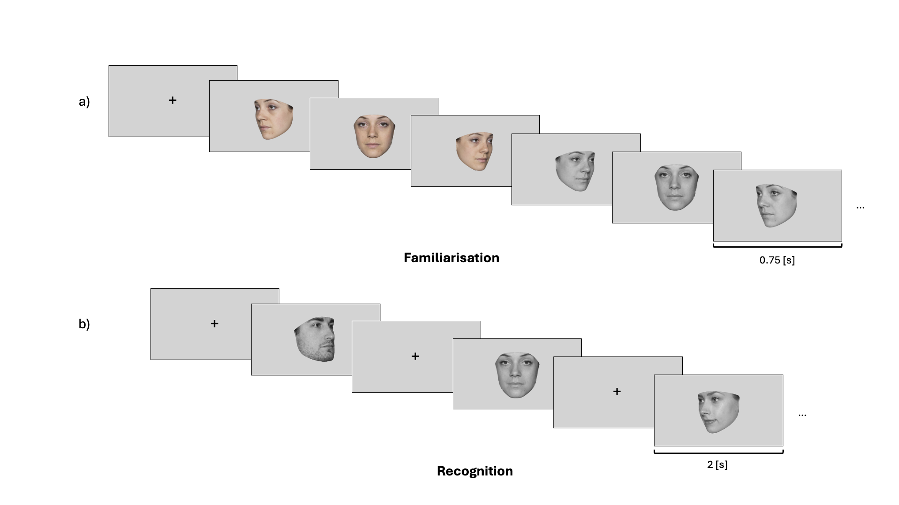
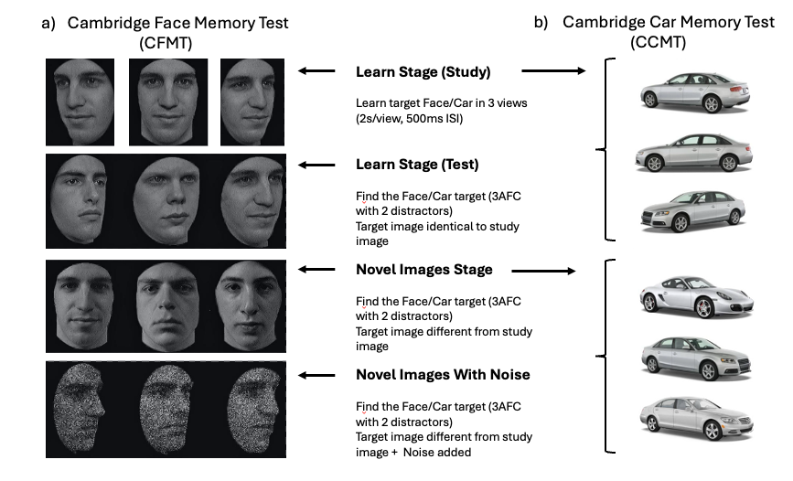

```{r}
#| label: setup
#| include: false
pkgs <- c(
  "tidyverse",
  "RColorBrewer",
  "patchwork",
  "paletteer",
  "here",
  "EMC2",
  "tidybayes",
  "tinytable",
  "osfr",
  "svglite",
  "gt",
  "brms",
  "rstantool",
  "corrplot",
  "ggdist",
  "parallel",
  "future",
  "ggplot2",
  "ggh4x"
)
vapply(
  pkgs,
  library,
  logical(1),
  character.only = TRUE,
  logical.return = TRUE
)

knitr::opts_chunk$set(echo = FALSE)

theme_set(
  theme_bw() +
    theme(
      text = element_text(size = 15, face = "bold"),
      title = element_text(size = 15, face = "bold"),
      legend.position = "none"
    )
)
## plot settings ##
## Plot colors
safe_pal <- paletteer_d("rcartocolor::Safe", 4)
dark_pal <- paletteer_d("RColorBrewer::Dark2", 2)

myColors_3 <- c(
  "novel" = safe_pal[1],
  "learned" = safe_pal[2]
)
myColors_4 <- c(
  "Novel" = safe_pal[1],
  "Learned" = safe_pal[2]
)

#Accuracy colors
myColors_acc <- c(
  "true" = dark_pal[1],
  "false" = dark_pal[2]
)
myColors_acc_2 <- c(
  "TRUE" = dark_pal[1],
  "FALSE" = dark_pal[2]
)
# Subsets for single-experiment plots if still needed
myColors_1 <- myColors_3[c("novel", "learned")]


## Set the amount of dodge in figures
pd <- position_dodge(0.7)
pd2 <- position_dodge(1)
```



# Introduction

Being able to quickly and accurately recognise other people is a central aspect of everyday social interactions, as well as more specific tasks, such as eye-witness identification and passport control checks.
However, face recognition ability varies across the population.
For instance, people with developmental prosopagnosia show relatively poor face recognition ability, [@dobelProsopagnosiaApparentCause2007; @mcconachieDevelopmentalProsopagnosiaSingle1976], whereas so-called “super-recognisers" show a remarkably high face recognition ability compared to the average person [@bobakSuperrecognisersActionEvidence2016; @russellSuperrecognizersPeopleExtraordinary2009]. Even if we ignore these two extreme cases, face recognition ability varies throughout the general population, especially when identifying unfamiliar individuals [@dowsettUnfamiliarFaceMatching2015; @whitePassportOfficersErrors2014]. Unsurprisingly, therefore, research has attempted to understand the mental processes that determine variation in face recognition ability as one way to probe the structure of social perception and cognition [@rhodes2014individual; @wang2012individual; @yovel2014individual]. Here, in this project, we move this research field forward by combining approaches from experimental, differential and mathematical psychology, to investigate how individual differences in face recognition ability relate to the computational processes that support face recognition.

Attempts to understand differences between individuals has a long history in psychological research.
Indeed, differential psychology represents a major branch of psychological research that aims to understand individual differences in thought, behaviour and ability [@marshEvolutionaryDifferentialPsychology2013; @lubinskiScientificSocialSignificance2000].
In the domain of face recognition, there is a growing interest in investigating individual differences across the entire spectrum of face recognition ability, rather than focusing on specific subgroups, such as "super-recognisers" [@whiteNeedImproveWay2022].
To this end, several assessment tools have been designed to measure different facets of face recognition performance [@duchaineCambridgeFaceMemory2006; @burtonGlasgowFaceMatching2010; @russellSuperrecognizersPeopleExtraordinary2009].
For example, the Cambridge Face Memory Test (@duchaineCambridgeFaceMemory2006) measures how many previously seen faces individuals can accurately recognise, with performance varying across the general population and being poorer in individuals with developmental prosopagnosia.
As such, these tools appear to have sufficient validity to represent a marker of an individuals face recognition ability.

Using these tools as a marker of face recognition ability, past research has estimated the association between the performance on these tests and broader perceptual and cognitive processes [@mccafferyIndividualDifferencesFace2018; @noyesFaceRecognitionAbility2018].
One line of research has studied the extent to which individual differences in face processing reflect domain-general or more domain-specific variation in perceptual and cognitive abilities [@mccafferyIndividualDifferencesFace2018; @verhallenGeneralSpecificFactors2017].
These findings show that face and general object recognition ability are positively, but modestly associated [@dennettCambridgeCarMemory2012; @richlerIndividualDifferencesObject2019; @wilmerCapturingSpecificAbilities2012].
Nonetheless, they remain constantly weaker than associations between different face recognition tasks [@fyshDifferencesIndividualsSubprocesses2020; @mccafferyIndividualDifferencesFace2018; @wilmerHumanFaceRecognition2010].
One interpretation of these results is that face recognition tasks rely partly on a specialised, domain-specific set of mental processes [@richler2019individual], in addition to more domain-general perceptual abilities.

The use of directly observed or manifest measures, such as reaction time and accuracy, has made a valuable contribution to understanding the relationship between psychological processes in general and in the context of face perception.
However, performance on such tests remains a distant proxy of the underlying cognitive processes at work during face recognition, which makes them far from ideal for capturing individual differences in cognitive processes [@hainesTheoreticallyInformedGenerative2020a].
An alternative approach to this problem has emerged in the domain of mathematical psychology and involves using a computational model to estimate latent computational parameters, which can be closer to the cognitive processes of interest [@yarkoniGeneralizabilityCrisis2022].
For instance, evidence-accumulation models translate the distribution of response times for correct and incorrect responses into parameters reflecting latent computational processes that are supposed to underlie the decision-making process (see @ratcliff2016diffusion for a review).

One example of such evidence-accumulation models is the linear ballistic accumulator (LBA) model (@fig-LBA) (@brownSimplestCompleteModel2008).
In two-alternatives forced choice tasks, this model describes the accumulation of evidence (drift rate parameter) towards the two alternative options.
Once the accumulation of evidence crosses a threshold, the corresponding response is then chosen.
Importantly, parameters from this model can be interpreted in psychologically meaningful ways: the drift rate parameter reflects the signal-to-noise ratio provided by the stimulus and the threshold parameter reflects the response caution towards a response (the amount of evidence needed to trigger a particular response; @myers2022practical).
As a consequence, one can then study how variation between people in these latent computational parameters, rather than manifest or observed measures, relates to key aspects of social behaviour, such as face recognition ability [@whiteUsingDecisionModels2016].

:::: {.place arguments="bottom, scope: \"parent\", float: true"}
:::{#fig-LBA fig-cap = "Schematic of the linear ballistic accumulator (LBA) model"}
{width="90%"}
:::
*This diagram represents the accumulation process one trial of a perceptual decision task for the linear ballistic accumulator (LBA;* @brownSimplestCompleteModel2008*). Participants are required to chose between two options (Response 1 and Response 2). In a LBA model, there is a separated accumulation of evidence (v) for each response option. In this example, the correct response is Response 1. The accumulator on the left is the accumulator for the correct response (Response 1), and the green line in represents the rate at which the evidence accumulates in favor of that response option. The accumulator on the right is the accumulator for the incorrect response (Response 2), and the dash red line represents the rate at which the evidence accumulates in favor of this response option. Once the accumulated evidence crosses the threshold (b) of a response option, the corresponding response is chosen (in this case Response 1).*
::::

Approaches from differential psychology have historically run alongside, and largely separate to, research traditions from experimental psychology, which aim to estimate the average effect (aggregated across individuals) of an experimental manipulation [@myers2006experimental].
For example, we previously used an experimental approach in combination with evidence accumulation modelling to study how familiarity impacts the computational processes that support face recognition [@fournier2026familiarity].
We found that different types of familiarity (visually familiar faces vs. famous faces) had a similar impact on the computational processes involved in the decision-making process of face recognition.
Compared to learned faces, novel faces induced a greater accumulation of evidence (drift rate), as well as modest increase in response caution (threshold).
Although we showed that these results could be replicated in both laboratory and online settings, the work aimed to estimate an average effect across a relatively small number of individuals (N\~30), rather than investigate individual differences.
As such, @fournier2026familiarity were unable to estimate how variation in face recognition ability between individuals shapes the computational processes that determine how face recognition judgements are made.

In the present study, therefore, we combined approaches from differential, experimental and mathematical psychology to investigate how latent computational parameters in face recognition relate to face recognition ability.
To do so, we used our prior face memory task [@fournier2026familiarity] to compute key latent parameters, whilst also measuring face recognition ability [@duchaineCambridgeFaceMemory2006] and general object recognition ability [@dennettCambridgeCarMemory2012] We also studied a considerably larger sample of participants (N\~300) than our prior work to enable more robust estimates of between participant individual differences.
Based on this research design, we were then able to estimate individual differences in drift rate and threshold as a function by face familiarity (i.e., novel vs visually familiar faces), as well as the extent to which such associations reflect the operation of domain-specific (face) or domain-general (object) processes.
In general, and based on past research on the development of expertise [@dutilh2009diffusion; @dutilh2011task; @parker2026evidence; @reinhartz2023mechanisms], we expect drift rate discrimination (the quality of the evidence accumulation) to positively correlate with face recognition ability, but it is less clear how threshold (response caution towards a response) may vary, as it is plausible that better face recognition could result in being more or less cautious.

# Method and Materials

## Pre-registration and open science

We report how we determined our sample size, all data exclusions (if any), all manipulations, and all measures in the study [@simonsConstraintsGeneralityCOG2017].
The research question, hypotheses, experimental design, planned analysis, and exclusion criteria were preregistered (<https://osf.io/b74gt/overview>).
Raw data and analysis code are available on Github (add link).

```{r}
#| label: exclusion-all
#| include: false
data <- read_csv(here::here("data/data.csv"))

exclusions <- read_csv(here::here("data/exclusion.csv"))

# ── Extract scalars for inline text ──────────────────────────────────────────
completed <- as.integer(
  exclusions$n_removed[exclusions$stage == "1"] +
    exclusions$n_remain[exclusions$stage == "1"]
)
exclude_missed_trials <- as.integer(exclusions$n_removed[
  exclusions$stage == "1"
])
exclude_rt <- as.integer(exclusions$n_removed[exclusions$stage == "2"])
exclude_acc <- as.integer(exclusions$n_removed[exclusions$stage == "3a"])
final <- as.integer(exclusions$n_remain[exclusions$stage == "3a"])
```

```{r}
#| label: demographics-all
#| include: false
demo <- read_csv(here("data/demo.csv"))

# ── Extract scalars for inline text ──────────────────────────────────────────
male <- as.integer(sum(demo$Sex == "Male"))
female <- as.integer(sum(demo$Sex == "Female"))
mean_age <- as.numeric(round(mean(demo$Age), 1))
sd_age <- as.numeric(round(sd(demo$Age), 1))
min_age <- as.numeric(min(demo$Age))
max_age <- as.numeric(max(demo$Age))
```

## Participants

All participants were recruited on the Prolific platform (<https://www.prolific.com>).
Participants had to be located in the United Kingdom or in the United States, be aged between 18-65 years old, with normal or corrected-to-normal vision and speak fluent English.
Furthermore, Prolific offers the option to chose the approval rate of the participants willing to take part in the study.
The approval rate is the percentage for which participants has been approved in previous experiment.
An approval rating between 95% and 100% was chosen in our study to try to ensure high data quality.
`r completed` participants completed the experiment.
Following our preregistered exclusion criterion, `r exclude_missed_trials` participants were excluded because their percentage of missed trials was higher than 40%, `r exclude_rt` because their percentage of RT outside the established range (0.2 to 2 seconds) were higher than 25% and `r exclude_acc` were removed because the overall accuracy was lower than 55%.
In the end, data from `r final` participants (`r male` men and `r female` women) were retained for the analysis and the LBA modeling.
Ages ranged from `r min_age` to `r max_age` ($M_{age} =$ `r mean_age`, $SD_{age} =$ `r sd_age`).
Following Prolific payment principles, each participant received 9£ for the completion of the study.
This experiment was accepted by the ethics committee of the Federal Institute of technology (ETH) Zurich.

## Material

Participant were asked to complete the study using a desktop computer.
Beforehand, the paradigm was tested on three different operative systems (PC, Macintosh and Linux) and on three web browsers (Google Chrome, Safari and Firefox).
Participant were aware that using any other combination of operative systems and web browsers might lead to the inability to complete the experiment and were asked to follow these directives to ensure a consistent procedure and participant experience.

## Procedure

The experiment was divided into three experimental tasks.
A face recognition task was used to estimate the LBA parameters from manifest measures (accuracy and response times).
Face and car recognition ability were assessed using the Cambridge Face Memory Test and the Cambridge Car Memory Test.
Participants always first underwent the face recognition task and the order of two memory tests was counterbalanced.

### Face recognition task

The face recognition task was divided into two distinct parts: a familiarization part and a recognition part.
During the familiarization part, unknown identities were presented on the screen and participants were instructed to memorize the identity of the faces.
One familiarization trial consisted of the presentation of 6 face images, one after the other, showing the same identity but varying in viewing points (3/4 left view, frontal view and 3/4 right view) and the colorimetry (colorful image, gray scale image).
The duration of each image presentation was set to 0.75 second and each participant underwent 30 familiarization trials (for 30 unknown identities).
During the familiarization, we introduced catch trials to ensure participants attention.
After some familiarization trials, a gray scale image of a person's face was presented on the screen.
Participants were asked to press the "q" key if the face belonged to the last seen identity or the "p" key if it was not.
The faces seen during the familiarization were considered the "Learned faces" within-subject condition.

In the recognition part, participants completed three blocks of 90 recognition trials.
Each block was separated from another by a short break.
Half of the trials were learned identities trials and the other half were new, previously unseen identities trials.
In each trial, a gray scale image of a face was shown on the screen.
Participants were asked to choose if they had previously seen this face in the familiarization part or not.
If they did, the should press the "q" key and if they did not, the "p" key.
Participants were asked to respond as quickly and accurately as possible.
It is important to note that participants never saw two pictures of the same learned identity in the same block and never saw the same picture (3/4 left view, frontal view, or 3/4 right view) of a learned identity during the entire recognition part.
Furthermore, each novel identity was only presented once in the entire recognition part.
Response time \[s\] and accuracy were collected after each recognition trial.
A response time limit of 2 seconds has been set for each recognition trial.
If participants took longer than 2 seconds to press a response key, the text "Too late!" appeared in red on the screen and the trial was discarded, but not replaced.

:::: {.place arguments="bottom, scope: \"parent\", float: true"}
:::{#fig-proc-exp fig-cap = "Experimental procedure of the face recognition task"}

:::
*The experimental procedure was divided into two parts: a familiarization part and a recognition part. a) In the familiarization part, participants were asked to memorize the face identity of 30 identities. For each identity, participants looked at 6 pictures depicting the same identity with different face orientation (3/4 left view, frontal view and 3/4 right view) and different colorimetry (color and gray scale images) in the order presented here: 3/4 left view, frontal view and 3/4 right view in color, followed by 3/4 right view, frontal view and 3/4 left view in gray scale. b) In each trial of the recognition part, participants had to decided if they recognize the face shown on the screen from the familiarization part. If they did, they had to press the "q" key and if the did not, the "p" key. They completed three blocks of 60 trials (half of them were from the familiarization part, half were novel faces). For the recognition part, only gray scale images of faces were used (for both learned faces and novel faces).*
::::

### Cambridge Memory Tests

The method of the CFMT was described in @duchaineCambridgeFaceMemory2006.
Participants learned 6 Caucasian male faces in three views and had to discriminate them later from distractor faces (no time response limit, three-alternative forced-choice task, @fig-Cambridge a).
Regarding the CCMT, the method has been described in @dennettCambridgeCarMemory2012 and has a highly similar structure, format and scoring as the CFMT, but uses cars instead of faces as stimuli.

:::: {.place arguments="bottom, scope: \"parent\", float: true"}
:::{#fig-Cambridge fig-cap = "The two Cambridge Memory Tests"}
{width="90%"}
:::
*Illustration of (a) the Cambridge Face Memory Test (CFMT; ref Duchain & Nakayama, 2006) and (b) the Cambridge Car Memory Test (CCMT; red Dennett et al., 2012a). These two tests are highly similar, differing only in the category of the presented stimuli. Both tests are composed of three stages: Learn (including Study and Test), Novel Images and Novel Images with Noise. In the Learn stage, participants learn target faces/cars and are then tested on the recognition of the identical images to the learned targets. In the Novel Images and Novel Images with Noise stages, recognition targets are different pictures of the same learned targets, but differing in views, lightning or both. For the CCMT (b), the car pictures showed here are not the one used in the CCMT and served only as a representation of the stimuli used in the Learn stage and the Novel stages of the CCMT. This illustration has been taken and slightly modified from* @dennettFaceAftereffectsPredict2012*.* *3AFC = three-alternative forced choice; ISI = interstimulus interval.*
::::

## Stimuli

The face images used in the faces recognition task consisted of images selected from two different data sets of face images: the Face Research Lab London Set (DeBruine, Lisa; Jones, Benedict (2017): <https://doi.org/10.6084/m9.figshare.5047666.v5>) and the Color FERET Database (<https://www.nist.gov/itl/products-and-services/color-feret-database>).
Each of these data sets is composed of images of different identities faces taken from different angle points.
102 identities were selected from the Face Research Lab London Set and 51 from the Color FERET Database.
For each selected identity, three pictures of the face at three different view points (3/4 left view, frontal view and 3/4 right view) were cropped following the outline of the face.

To ensure that the stimuli that we used are reproducible, we used the webmorphR R Package [@webmorph] to crop the face images.
The code used to crop the original pictures can be found on OSF (OSF link).

## Evidence accumulation modeling

The model and priors specification as well as the model estimation are all identical to the one described in (ref: Fournier et al., in press).
The priors specifications are described in Supplementary Materials.

### Model specification

A hierarchical LBA models was fit to the accuracy and response times of the face recognition task.
The model specifications are outlined in our preregistration (@tbl-model-formula).
The LBA framework assumes a separate evidence accumulator for each response alternative, with potentially different parameter values.
Accordingly, one accumulator corresponded to the "Learned" response and the other to the "Novel" response.
Threshold was allowed to vary by participants' response (Learned/Novel) and mean drift rate varied as a function of both stimulus type (Learned/Novel) and weather the accumulator corresponded to the correct response for that stimulus (TRUE vs. FALSE).
For example, when a Learned stimulus was presented, the Learned accumulator was designed as TRUE, whereas the Novel accumulator was designed as FALSE.
The difference in drift rate between the TRUE and FALSE accumulators reflects the quality of information supporting a decision, with larger differences indicating stronger and more discriminative evidence accumulation [@lewandowskyComputationalModelingCognition2018].
The standard deviation of the TRUE accumulator was allowed to vary according to accumulator match status, whereas the standard deviation of the FALSE accumulator was constrained to be constant to ensure model identifiability [@donkinGettingMoreAccuracy2009].
In the preregistered model, a single start-point parameter (A), and single non-decision time parameter (t0) were estimated.
Alternative model specifications that permitted variation in these parameters are reported in the Supplementary Materials.

```{r}
#| label: data-model-formula
#| include: false
# create a table
lba_formula <- tribble(
  ~Parameter            , ~Label       , ~Condition , ~Response , ~Accuracy , ~Fixed ,
  "Start point"         , "A"          , "no"       , "no"      , "no"      , "-"    ,
  "Mean drift rate"     , "v"          , "yes"      , "no"      , "yes"     , "-"    ,
  "SD drift rate"       , "sd_v"       , "no"       , "no"      , "yes"     , "-"    ,
  "SD false drift rate" , "false.sd_v" , "-"        , "-"       , "-"       , "1"    ,
  "Threshold"           , "b"          , "no"       , "yes"     , "no"      , "-"    ,
  "Non-decision time"   , "t0"         , "no"       , "no"      , "no"      , "-"
)
```

```{r}
#| label: tbl-model-formula
#| tbl-cap: "Formula specification for the pre-registered linear ballistic accumulator model."
#| include: true
lba_formula |>
  tt(
    notes = "Condition = training condition (Learned vs. Novel); Response = key-press response (same vs. different); Accuracy = (true/correct vs false/incorrect); SD = standard deviation."
  )
```

### Model estimation

Bayesian model estimated was carried using the EMC2 R package [@EMC2].
Priors were chosen to be weakly-informative, meaning that they have little influence on the estimation (for more details regarding the priors of each model, see Supplementary Materials).
Two sampling steps were used to estimate the parameters.
First, a separate estimation of the fixed effects for each participant was conducted.
Parameter estimations were then used as the starting point for the full hierarchical parameter estimation.

### Model fit

To ensure that the fit of our model can capture most of the main trends in the data, graphical summaries of the posterior predictions were examined.
Convergence plots and posterior predictive checks can be found in Supplementary Materials.

## Data analysis

### An overview of our general analytical strategy

We used two main analytical approaches to address our research questions.
First, we used correlations and data visualizations to characterize the zero-order relationships between parameters of interest (drift rate and threshold) from the LBA model with face and object recognition ability.
We used a "classical" correlation approach to generate point estimates of the correlation value and present those alongside scatter plots, as well as a Bayesian plausible value correlation approach to estimate the uncertainty in the estimated correlation values.
Second, we used linear regression to estimate how LBA parameters vary as a function of face recognition ability, both before and after adjusting for general object (car) recognition ability.
The details of the analysis plan were preregistered (<https://osf.io/b74gt/overview>) and more specific details are presented below.

### LBA parameters

In order to make inference about the potential associations between LBA parameters and recognition abilities, subject specific estimates and group estimates posterior distributions were computed.
Group estimates were contrasted across conditions (learned vs novel) to establish that the basic experimental effect found in @fournier2026familiarity is replicable at the group level.
To summarize the distribution of parameters of interest, we report the median of the posterior distribution together with 95% quantile interval of the posterior distribution.
Assessment of individual differences in parameter estimates was pursued using subject specific estimates.

### Classical correlational analysis

To assess the relationship between LBA parameters and Cambridge Memory tests, we computed the median value of each parameter's posterior distribution with the z-scored scores of each Memory Tests.
For the threshold parameter, we computed the median of the two threshold parameters (threshold for learned and novel responses).
For the drift rate parameter, we computed the median of the median of the six drift rate parameters.
Drift rate (TRUE) reflects the accumulation of evidence when the response was correct (accumulation of signal) whereas drift rate (FALSE) represents the accumulation of evidence when the response was incorrect (accumulation of noise).
Drift rate (TRUE-FALSE) is the subtraction drift rate (TRUE) - drift rate (FALSE) and represent the signal to noise ratio provided by the stimulus.
For each stimulus condition (learned and novel), the median drift rate (TRUE), drift rate (FALSE) and drift rate (TRUE-FALSE) was computed.
All the these median parameters were then correlated with the z-transformed scores of each Memory Test (Cambridge Face Mmeory Test and Cambridge Car Memory Test).

### Bayesian plausible value correlational analysis

In addition to the classical correlational analysis described above, we conducted a Bayesian plausible value correlation approach [@lyFlexibleEfficientHierarchical2017; @matzkeBayesianInferenceCorrelations2017].
Instead of using point estimates (median value of each parameter's posterior distribution), this approach permits the estimation of uncertainty in likely correlational values by correlating the parameter estimation from each sample (or “draw”) from the posterior distribution with the memory scores.
A distribution of the plausible correlations between each parameter and the memory scores can then be obtained.
These distributions can then be compared between stimuli conditions (Learned vs Novel) or memory scores (face vs car) using difference contrasts.
By summarising the posterior distribution of these correlation values, this approach naturally lends itself to estimates of the uncertainty of the estimated correlation values.

### Bayesian linear regression

Using Bayesian linear regression allowed us ot investigate how individual differences in face recognition ability predicted the median drift rate values.
Based on our pilot results, we preregistered two Bayesian linear regression models to quantify the extent to which drift rate vary as a function of face recognition ability alone and when accounting for car recognition ability (see @tbl-regression-model-formula for the details of each regression models).
More specifically, the first model (Face model) predicts the median drift rate value as a function of the interaction effect between condition (learned vs novel) and accuracy (TRUE vs FALSE) and the main effect of face recognition ability (z-transformed scores to the Cambridge Face Memory score).
An index coding approach (no grand intercept) was used, meaning that each sub-term of the interaction term has its own intercept (Learned_TRUE, Learned_FALSE, Novel_TRUE and Novel_FALSE).
To account for non-face recognition ability, we added the z-transformed scores of the Cambridge Car Memory Test as a predictor to the second model.
Regarding threshold, the two models as well as the results of the linear regression are available in the Supplementary materials.
The bayesian linear models were fitted using the brms R package [@brms].

```{r}
#| label: regression-model-formula
#| include: false
# create a df
regression_formula <- tribble(
  ~Parameter          , ~Condition             , ~Ability     , ~Formula                                                                                     ,
  "Median drift rate" , "familiarity:accuracy" , "Face"       , "Median drift rate:  0 + familiarity:accuracy + face_ability + (0|participant)"              ,
  "Median drift rate" , "familiarity:accuracy" , "Face + Car" , "Median drift rate: 0 + familiarity:accuracy + face_ability + car_ability + (0|participant)" ,
)
```

```{r}
#| label: tbl-regression-model-formula
#| tbl-cap: "Formula specification for the pre-registered linear regression models."
#| include: true
regression_formula |>
  tt(
    notes = "familiarity = face familiarity (Learned vs. Novel); accuracy = response accuracy (TRUE vs. FALSE)"
  )
```

### Inferential criteria

Using a Bayesian approach in our regression analysis allowed us to evaluate the posterior distributions of the parameter of our predictor of interest (Face Memory score).
To evaluate these posterior distributions, we used three complementary criteria: sign, size and precision [@cummingNewStatisticsWhy2014; @kruschkeBayesianDataAnalysis2018; @mcelreath2018statistical].
To address the sign (or direction) of the effect, we reported if the median value is positive or negative.
Second, we evaluated the size or magnitude of the posterior distribution by considering the size of the median value as well as the extent to which lower or upper bounds of the 95% quantile interval approach zero (no relationship).
For example, if the 95% quantile interval excluded zero, we would have been reasonably confident in our inference of a non-zero effect.
Furthermore, we used the width of the 95% quantile intervals as an indicator of estimation precision.
Whereas narrow estimates indicate precise estimates, wider intervals indicate substantial uncertainty about the estimated parameter value, which may warrant a more cautious interpretation.

# Results

We preregistered to assess the relationships between the two recognition abilities (Face and Car) and the LBA parameters (drift rate and threshold).
Since our research questions focus on the associations between face recognition ability only and these LBA parameters, we are showing the results of these associations in this Results section.
The results of the associations between car recognition ability and LBA parameters can be found in Supplementary Materials.

## Estimates of the LBA parameters

In this section, we describe the posterior distributions of the drift rate and threshold parameters for both Learned and Novel faces estimated from the distribution of response times and accuracy collected in the face recognition task.
These distributions reflect the group-level effects of the two stimulus condition on drift rate (learned vs novel) and response conditions on threshold (learned vs novel).
Contrasts between conditions were plotted to assess the difference between them as well as to establish that the basic experimental effects found in @fournier2026familiarity was replicated at the group level with larger sample size.
Posterior distributions for threshold and drift rate parameters are visualized in @fig-param and the medians and 95% quantile intervals are summarized in @tbl-lba-params.

```{r}
#| label: load-lba-data
#| include: false
theta_group <- read_csv(here("data/theta_group.csv"))
theta_group_q <- read_csv(here("data/theta_group_q.csv"))
theta_pid <- read_csv(here("data/theta_pid.csv"))
theta_pid_q <- read_csv(here("data/theta_pid_q.csv"))
```

```{r}
#| label: wrangle-threshold
#| include: false
thresh_group <- theta_group |>
  filter(str_detect(param, "B_")) |>
  mutate(
    response = if_else(str_detect(param, "lRlearned"), "Learned", "Novel"),
    response = factor(response, levels = c("Novel", "Learned"))
  )

thresh_pid <- theta_pid |>
  filter(str_detect(param, "B_")) |>
  mutate(
    response = if_else(str_detect(param, "lRlearned"), "Learned", "Novel"),
    response = factor(response, levels = c("Novel", "Learned"))
  )

thresh_diff_group <- thresh_group |>
  pivot_wider(id_cols = c(.draw), names_from = response, values_from = value) |>
  mutate(diff = Novel - Learned)

thresh_diff_pid <- thresh_pid |>
  pivot_wider(
    id_cols = c(pid, .draw),
    names_from = response,
    values_from = value
  ) |>
  mutate(diff = Novel - Learned)

# quantiles
thresh_diff_group_q <- thresh_diff_group |> median_qi(diff)
thresh_diff_pid_q <- thresh_diff_pid |> group_by(pid) |> median_qi(diff)
```

```{r}
#| label: wrangle-drift
#| include: false
drift_group <- theta_group |>
  filter(str_detect(param, "v_S")) |>
  mutate(
    condition = if_else(str_detect(param, "novel"), "Novel", "Learned"),
    accuracy = if_else(str_detect(param, "TRUE"), "true", "false"),
    condition = factor(condition, levels = c("Novel", "Learned")),
    accuracy = factor(accuracy, levels = c("false", "true"))
  )

drift_pid <- theta_pid |>
  filter(str_detect(param, "v_S")) |>
  mutate(
    condition = if_else(str_detect(param, "novel"), "Novel", "Learned"),
    accuracy = if_else(str_detect(param, "TRUE"), "true", "false"),
    condition = factor(condition, levels = c("Novel", "Learned")),
    accuracy = factor(accuracy, levels = c("false", "true"))
  )

# true - false per condition
drift_acc_diff_group <- drift_group |>
  pivot_wider(
    id_cols = c(.draw, condition),
    names_from = accuracy,
    values_from = value
  ) |>
  mutate(diff = true - false)

drift_acc_diff_pid <- drift_pid |>
  pivot_wider(
    id_cols = c(pid, .draw, condition),
    names_from = accuracy,
    values_from = value
  ) |>
  mutate(diff = true - false)

# novel - learned contrast
drift_cond_diff_group <- drift_acc_diff_group |>
  pivot_wider(id_cols = .draw, names_from = condition, values_from = diff) |>
  mutate(diff = Novel -Learned)

drift_cond_diff_pid <- drift_acc_diff_pid |>
  pivot_wider(
    id_cols = c(pid, .draw),
    names_from = condition,
    values_from = diff
  ) |>
  mutate(diff = Novel - Learned)

# quantiles
drift_acc_diff_group_q <- drift_acc_diff_group |>
  group_by(condition) |>
  median_qi(diff)
drift_cond_diff_group_q <- drift_cond_diff_group |> median_qi(diff)
drift_cond_diff_pid_q <- drift_cond_diff_pid |> group_by(pid) |> median_qi(diff)
```

*Threshold*: Inspection of the posterior distributions shows that there is an effect of familiarity on the threshold parameter.
The threshold parameter is higher for the Novel response compared to the Learned response.

```{r}
#| label: fig-param
#| fig-cap: " Threshold and drift rate estimates"
#| fig-subcap:
#|   - "Left panel: Threshold by response / Right panel: Threshold (novel - learned) contrast"
#|   - "Left panel: Drift rate (TRUE - FALSE) by stimulus / Right panel: Drift rate (novel - learned) contrast"
#| layout-nrow: 2
#| fig-height: 5
#| fig-width: 10

# Threshold plots
# Left panel: condition distributions
p_thresh_group_cond <- ggplot(thresh_group, aes(x = value, y = fct_rev(response), fill = response)) +
  stat_halfeye(alpha = 0.7) +
  geom_vline(xintercept = 0, colour = "darkgrey") +
  scale_fill_manual(values = myColors_4) +
  scale_y_discrete(drop = TRUE) +
  theme(
    text = element_text(size = 6, face = "bold"),
    strip.text = element_text(size = 6, face = "bold"),
    axis.text = element_text(size = 10, face = "bold"),
    axis.title = element_text(size = 12, face = "bold")
  ) +
  labs(x = "Threshold", y = "Response")

# Right panel: contrast
p_thresh_group_diff <- ggplot(thresh_diff_group, aes(x = diff, y = "")) +
  stat_halfeye(alpha = 0.7, fill = "#1A7A7A") +
  geom_vline(xintercept = 0, colour = "darkgrey") +
  theme(
    text = element_text(size = 6, face = "bold"),
    strip.text = element_text(size = 6, face = "bold"),
    axis.text = element_text(size =10, face = "bold"),
    axis.title = element_text(size = 12, face = "bold")
  ) +
  labs(x = "Threshold (Novel - Learned)", y = "")

# Drift rate plots
# Left panel: condition distributions
p_drift_group_cond <- ggplot(
  drift_acc_diff_group,
  aes(x = diff, y = fct_rev(condition), fill = condition)
) +
  stat_halfeye(alpha = 0.7) +
  geom_vline(xintercept = 0, colour = "darkgrey") +
  scale_fill_manual(values = myColors_4) +
  scale_y_discrete(drop = TRUE) +
  theme(
    text = element_text(size = 6, face = "bold"),
    strip.text = element_text(size = 6, face = "bold"),
    axis.text = element_text(size = 10, face = "bold"),
    axis.title = element_text(size = 12, face = "bold")
  ) +
  labs(x = "Drift rate (TRUE - FALSE)", y = "Condition")

# Right panel: contrast
p_drift_group_diff <- ggplot(drift_cond_diff_group, aes(x = diff, y = "")) +
  stat_halfeye(alpha = 0.7, fill = "#1A7A7A") +
  geom_vline(xintercept = 0, colour = "darkgrey") +
  theme(
    text = element_text(size = 6, face = "bold"),
    strip.text = element_text(size = 6, face = "bold"),
    axis.text = element_text(size = 10, face = "bold"),
    axis.title = element_text(size = 12, face = "bold")
  ) +
  labs(x = "Drift rate (Novel - Learned)", y = "")


p_thresh_group_cond | p_thresh_group_diff
p_drift_group_cond | p_drift_group_diff
```

*Drift rate*: Inspection of the posterior distributions shows that there is a familiarity effect in drift rate difference.
The quality of the evidence accumulation was greater for Novel faces compared to Learned faces.

```{r}
#| label: tbl-lba-params
#| tbl-cap: "Posterior median and 95% quantile intervals for threshold and drift rate parameters."
#| include: true
# Build table
thresh_cond_table <- theta_group_q |>
  filter(str_detect(param, "B_")) |>
  mutate(
    parameter = "Threshold",
    condition = case_when(
      str_detect(param, "lRnovel") ~ "Novel",
      str_detect(param, "lRlearned") ~ "Learned",
    )
  ) |>
  select(parameter, condition, median = value, lower = .lower, upper = .upper)

thresh_table <- thresh_diff_group |>
  median_qi(diff) |>
  mutate(
    parameter = "Threshold contrast",
    condition = "Novel - Learned",
  ) |>
  select(parameter, condition, median = diff, lower = .lower, upper = .upper)

drift_table <- drift_acc_diff_group |>
  group_by(condition) |>
  median_qi(diff) |>
  mutate(parameter = "Drift rate") |>
  select(parameter, condition, median = diff, lower = .lower, upper = .upper)

drift_diff_table <- drift_cond_diff_group |>
  median_qi(diff) |>
  mutate(
    parameter = "Drift rate contrast",
    condition = "Novel - Learned"
  ) |>
  select(parameter, condition, median = diff, lower = .lower, upper = .upper)

## Combine
lba_table <- bind_rows(
  thresh_cond_table,
  thresh_table,
  drift_table,
  drift_diff_table
) |>
  mutate(
    qi = paste0("[", round(lower, 3), ", ", round(upper, 3), "]"),
    median = round(median, 3),
    Parameter = factor(
      parameter,
      levels = c(
        "Threshold",
        "Threshold contrast",
        "Drift rate",
        "Drift rate contrast"
      )
    ),
    Condition = factor(
      condition,
      levels = c(
        "Novel",
        "Learned",
        "Novel - Learned"
      )
    )
  ) |>
  arrange(Parameter, Condition) |>
  select(
    Parameter,
    Condition,
    Median = median,
    `95% QI` = qi
  )
lba_table |>
  tt(
    notes = "QI = quantile interval."
  ) |>
  format_tt(j = "Median", digits = 2, num_fmt = "decimal") |>
  style_tt(fontsize = 0.85)
```

## Classical correlation analysis

To estimate the association between LBA parameters and face recognition ability, we computed the linear relationship between the median of the posterior distribution of each estimated parameters of interest and the face recognition ability scores centred (z-transformed).
These relationships can be seen in @fig-corr-point-estimates.

*Threshold*: Visual inspection of the point estimates correlations shows that when face recognition ability increases, the threshold for learned faces, reflecting the response caution towards the "learned" response, increases.
The response caution towards novel faces only seems to increase when car recognition ability increases.

*Drift rate*: Visual inspection of the point estimates correlations shows that when face recognition ability increases, the drift rate (TRUE-FALSE) for learned and novel faces, reflecting the signal-to-noise ratio provided by learned faces, increases as well.

However, the strength of these relationship remains weak (the highest *r* value is 0.24).

```{r}
#| label: load-Cambridge-test
#| include: false
## read in the pid data
cambridge_acc_pid <- read_csv(
  here("data", "cambridge_acc_scores_pid.csv")
)
head(cambridge_acc_pid)
glimpse(cambridge_acc_pid)

## filter and wrangle
## face scores
cam_face <- cambridge_acc_pid |>
  filter(task == "face") |>
  rename(face_recog = n_correct) |>
  mutate(
    face_recog_centred = face_recog - mean(face_recog, na.rm = TRUE)
  ) |>
  select(pid, face_recog, face_recog_centred)
```

```{r}
#| label: corr-point-estimates
#| include: false
cor_data <- theta_pid_q |>
  select(pid, param, value) |>
  pivot_wider(names_from = param, values_from = value) |>
  left_join(cam_face, by = "pid") |>
  # derived contrasts
  mutate(
    # drift discrimination (true - false) per condition
    discrim_novel = v_Snovel_lMTRUE - v_Snovel_lMFALSE,
    discrim_learned = v_Slearned_lMTRUE - v_Slearned_lMFALSE,
    # cross-condition drift contrast (novel - learned discrimination)
    discrim_diff = discrim_novel - discrim_learned,
    # threshold contrast
    thresh_diff = B_lRnovel - B_lRlearned
  )
param_cols <- c(
  "v_Snovel_lMTRUE",
  "v_Snovel_lMFALSE",
  "v_Slearned_lMTRUE",
  "v_Slearned_lMFALSE",
  "B_lRnovel",
  "B_lRlearned",
  "discrim_learned",
  "discrim_novel"
)

# pivot to long with both predictors as a variable
cor_long <- cor_data |>
  pivot_longer(
    cols = all_of(param_cols),
    names_to = "param",
    values_to = "estimate"
  ) |>
  pivot_longer(
    cols = c(face_recog_centred),
    names_to = "Face",
    values_to = "score"
  ) |>
  mutate(
    param = fct_recode(
      param,
      "Drift rate learned (TRUE)" = "v_Slearned_lMTRUE",
      "Drift rate learned (FALSE)" = "v_Slearned_lMFALSE",
      "Drift rate novel (TRUE)" = "v_Snovel_lMTRUE",
      "Drift rate novel (FALSE)" = "v_Snovel_lMFALSE",
      "Threshold novel" = "B_lRnovel",
      "Threshold learned" = "B_lRlearned",
      "Drift rate learned (TRUE-FALSE)" = "discrim_learned",
      "Drift rate novel (TRUE-FALSE)" = "discrim_novel"
    )
  )

# compute r per param x predictor
cor_long_thresh <- cor_long |>
  filter(param %in% c("Threshold learned", "Threshold novel")) |>
  rename(Threshold = param) |>
  mutate(Threshold = fct_recode(Threshold, Novel="Threshold novel", Learned = "Threshold learned"))

cor_labels_thresh <- cor_long_thresh |>
  group_by(Threshold, Face) |>
  summarise(
    r = cor(estimate, score, use = "complete.obs"),
    .groups = "drop"
  ) |>
  mutate(
    label = sprintf("r = %.2f", r),
    vjust = if_else(Threshold == "Learned", 1.5, 3.0)
  )

cor_long_drift <- cor_long |>
  filter(
    param %in%
      c(
        "Drift rate learned (TRUE)",
        "Drift rate learned (FALSE)",
        "Drift rate learned (TRUE-FALSE)",
        "Drift rate novel (TRUE)",
        "Drift rate novel (FALSE)",
        "Drift rate novel (TRUE-FALSE)"
      )
  ) |>
  mutate(
    param = fct_relevel(
      param,
      "Drift rate learned (TRUE)",
      "Drift rate learned (FALSE)",
      "Drift rate learned (TRUE-FALSE)",
      "Drift rate novel (TRUE)",
      "Drift rate novel (FALSE)",
      "Drift rate novel (TRUE-FALSE)"
    )
  ) |>
  mutate(
    condition = case_when(
      str_detect(param, "learned") ~ "Learned",
      str_detect(param, "novel")   ~ "Novel",
      TRUE ~ NA_character_
    ),
    drift = case_when(
      str_detect(param, "TRUE-FALSE") ~ "Drift rate (TRUE-FALSE)",
      str_detect(param, "\\(TRUE\\)")  ~ "Drift rate (TRUE)",
      str_detect(param, "\\(FALSE\\)") ~ "Drift rate (FALSE)",
      TRUE ~ NA_character_
    ),
    drift = fct_relevel(
      drift,
      "Drift rate (TRUE)",
      "Drift rate (FALSE)",
      "Drift rate (TRUE-FALSE)"
    ),
    face_type = factor(condition, levels = c("Learned", "Novel"))
  )
  

cor_labels_drift <- cor_long_drift |>
  group_by(drift, condition) |>
  summarise(
    r = cor(estimate, score, use = "complete.obs"),
    .groups = "drop"
  ) |>
  mutate(
    label = sprintf("r = %.2f", r),
    vjust = if_else(condition == "Learned", 1.5, 3.0)
  ) |>
  mutate(drift = fct_relevel(
    drift,
      "Drift rate (TRUE)",
      "Drift rate (FALSE)",
      "Drift rate (TRUE-FALSE)"
  ))
```

```{r}
#| label: prepare-plot-corr-point-estimate
#| include: false
# plot thresh
p_raw_params_thresh <- ggplot(
  cor_long_thresh,
  aes(x = score, y = estimate, colour = Threshold, fill = Threshold)
) +
  geom_point(alpha = 0.3, size = 2) +
  geom_smooth(method = "lm", se = TRUE, alpha = 0.3) +
  geom_text(
    data = cor_labels_thresh,
    aes(label = label, vjust = vjust, colour = Threshold),
    x = -Inf,
    y = Inf,
    hjust = -0.1,
    size = 5,
    fontface = "bold",
    show.legend = FALSE
  ) +
  scale_colour_manual(values = myColors_4) +
  scale_fill_manual(values = myColors_4) +
  labs(
    x = "Face recognition score (centred)",
    y = "Parameter estimate (median)",
    colour = NULL,
    fill = NULL
  ) +
  theme(legend.position = "bottom")


# plot drift
p_raw_params_drift <- ggplot(
  cor_long_drift,
  aes(x = score, y = estimate, colour = condition, fill = condition)
) +
  geom_point(alpha = 0.3, size = 2) +
  geom_smooth(method = "lm", se = TRUE, alpha = 0.3) +
  geom_text(
    data = cor_labels_drift,
    aes(label = label, vjust = vjust, colour = condition),
    x = -Inf,
    y = Inf,
    hjust = -0.1,
    size = 5,
    fontface = "bold",
    show.legend = FALSE
  ) +
  facet_wrap(~drift, scales = "free_y", ncol = 3) +
  scale_colour_manual(values = myColors_4) +
  scale_fill_manual(values = myColors_4) +
  labs(
    x = "Face recognition score (centred)",
    y = "Parameter estimate (median)",
    colour = NULL,
    fill = NULL
  ) +
  theme(legend.position = "bottom")
```

```{r}
#| label: fig-corr-point-estimates
#| fig-cap: "Point estimates correlations with recognition scores. In (b), drift rate (TRUE) reflects the accumulation of evidence when the response is correct and drift rate (FALSE) the accumulation of evidence when the response is incorrect. Drift rate (TRUE-FALSE) represent the signal-to-noise ratio provided by the stimulus."
#| fig-subcap: 
#|  - "Median threshold correlations with face recognition ability"
#|  - "Median drift rates correlations with face recognition ability"
#| layout-ncol: 1
#| warning: false
#| fig-width: 10
#| fig-height: 7
p_raw_params_thresh
p_raw_params_drift
```

## Bayesian plausible value correlational analysis

To estimate the uncertainty linked to the relationships between LBA estimated parameters and face recognition ability, we used a Bayesian plausible value correlational analysis.
Like described above (see Methods), instead of using a single point estimate to assess the strength of the relationship between our variables of interest, the posterior distribution of the LBA parameters allows us to use the entire sampling distribution to do it.
We calculated the Person's *r* between each sample value from our posterior distribution for each parameter of each subject and their face recognition ability.
The posterior distributions of threshold plausible correlation values are shown in @fig-plausible-corr-thresh.
Posterior correlations for the different drift rate parameters for both conditions and face recognition ability can be found in @fig-plausible-corr-drift.
For both threshold and drift rate, we evaluated the 95% CI of the posterior distributions.
If the 95% CI of the distribution does not include 0, we would be confident in the existence of a relationship between these parameters and the face recognition ability.
@tbl-plausible-cor provides a summary of these distributions.

```{r}
#| label: plausible-value-wrangle
#| include: false
param_cols <- c(
  "v_Snovel_lMTRUE",
  "v_Snovel_lMFALSE",
  "v_Slearned_lMTRUE",
  "v_Slearned_lMFALSE",
  "sv_lMTRUE",
  "B_lRnovel",
  "B_lRlearned",
  "A",
  "t0"
)

all_prereg_params <- c(
  param_cols,
  "discrim_novel",
  "discrim_learned"
)

param_labels <- c(
  B_lRnovel = "Threshold: Novel",
  B_lRlearned = "Threshold: Learned",
  v_Snovel_lMTRUE = "Drift: Novel (TRUE)",
  v_Snovel_lMFALSE = "Drift: Novel (FALSE)",
  discrim_novel = "Drift: Novel (TRUE-FALSE)",
  v_Slearned_lMTRUE = "Drift: Learned (TRUE)",
  v_Slearned_lMFALSE = "Drift: Learned (FALSE)",
  discrim_learned = "Drift: Learned (TRUE-FALSE)"
)

# join theta_pid (full posterior) with cambridge scores
# theta_pid has 300 pids x 9 params x 15000 draws
pv_data <- theta_pid |>
  pivot_wider(names_from = param, values_from = value) |>
  mutate(
    discrim_novel = v_Snovel_lMTRUE - v_Snovel_lMFALSE,
    discrim_learned = v_Slearned_lMTRUE - v_Slearned_lMFALSE
  ) |>
  left_join(
    cam_face |> select(pid, face_recog_centred),
    by = "pid"
  ) |>
  pivot_longer(
    cols = all_of(all_prereg_params),
    names_to = "param",
    values_to = "estimate"
  )

# compute correlation for each draw x param x predictor
# this will take a moment with 15000 draws
pv_cors <- pv_data |>
  group_by(.draw, param) |>
  summarise(
    r_face = cor(estimate, face_recog_centred, use = "complete.obs"),
    .groups = "drop"
  ) |>
  pivot_longer(
    cols = c(r_face),
    names_to = "Face",
    values_to = "r"
  )
pv_summary <- pv_cors |>
  group_by(param) |>
  median_qi(r, .width = c(0.95)) |>
  mutate(label = param_labels[param]) |>
  print(n = Inf)
```

```{r}
#| label: create-plausible-value-corr-plots-thresh
#| include: false
# left panel — novel and learned
pv_thresh_main <- pv_cors |>
  filter(param %in% c("B_lRnovel", "B_lRlearned")) |>
  mutate(
    response = if_else(param == "B_lRnovel", "Novel", "Learned"),
    response = factor(response, levels = c("Learned", "Novel"))
  )

p_thresh_left <- ggplot(
  pv_thresh_main,
  aes(x = r, y = "", fill = response)
) +
  stat_halfeye(alpha = 0.7, .width = c(0.5, 0.95)) +
  geom_vline(xintercept = 0, linetype = "dashed", colour = "darkgrey") +
  scale_fill_manual(values = myColors_4) +
  scale_colour_manual(values = myColors_4) +
  labs(
    x = "Plausible r value",
    y = "Density",
    fill = NULL,
    colour = NULL
  ) +
  theme(
    legend.position = "bottom",
    text = element_text(size = 5, face = "bold"),
    strip.text = element_text(size = 5, face = "bold"),
    axis.text = element_text(size = 12, face = "bold"),
    axis.title = element_text(size = 14, face = "bold"),
    legend.text = element_text(size = 12, face = "bold")
  )
```

```{r}
#| label: create-plausible-value-corr-plots-drift
#| include: false
# first panel - drift rate true and false
pv_drift_true_false <- pv_cors |>
  filter(
    param %in%
      c(
        "v_Slearned_lMTRUE",
        "v_Slearned_lMFALSE",
        "v_Snovel_lMTRUE",
        "v_Snovel_lMFALSE"
      )
  ) |>
  mutate(
    condition = if_else(
      param == "v_Slearned_lMTRUE",
      "Learned",
      if_else(param == "v_Slearned_lMFALSE", "Learned", "Novel")
    ),
    accuracy = if_else(
      param == "v_Slearned_lMTRUE",
      "TRUE",
      if_else(param == "v_Snovel_lMTRUE", "TRUE", "FALSE")
    ),
    accuracy = factor(accuracy, levels = c("TRUE", "FALSE"))
  )

p_drift_first <- ggplot(
  pv_drift_true_false,
  aes(x = r, y = condition, fill = accuracy)
) +
  stat_halfeye(alpha = 0.7, .width = c(0.5, 0.95)) +
  geom_vline(xintercept = 0, linetype = "dashed", colour = "darkgrey") +
  scale_fill_manual(values = myColors_acc_2) +
  scale_colour_manual(values = myColors_acc_2) +
  labs(
    x = "Plausible r value",
    y = NULL,
    fill = NULL,
    colour = NULL
  ) +
  theme(
    legend.position = "bottom",
    text = element_text(size = 5, face = "bold"),
    strip.text = element_text(size = 5, face = "bold"),
    axis.text = element_text(size = 12, face = "bold"),
    axis.title = element_text(size = 14, face = "bold"),
    legend.text = element_text(size = 12, face = "bold")
  )

# middle panel — discrimination (true - false) per condition
pv_drift_discrim <- pv_cors |>
  filter(param %in% c("discrim_novel", "discrim_learned")) |>
  mutate(
    condition = if_else(param == "discrim_novel", "Novel", "Learned"),
    condition = factor(condition, levels = c("Learned", "Novel"))
  )

p_drift_mid <- ggplot(
  pv_drift_discrim,
  aes(x = r, y = "", fill = condition)
) +
  stat_halfeye(alpha = 0.7, .width = c(0.5, 0.95)) +
  geom_vline(xintercept = 0, linetype = "dashed", colour = "darkgrey") +
  scale_fill_manual(values = myColors_4) +
  scale_colour_manual(values = myColors_4) +
  labs(
    x = "Plausible r value",
    y = "Density",
    fill = NULL,
    colour = NULL
  ) +
  theme(
    legend.position = "bottom",
    text = element_text(size = 5, face = "bold"),
    strip.text = element_text(size = 5, face = "bold"),
    axis.text = element_text(size = 12, face = "bold"),
    axis.title = element_text(size = 14, face = "bold"),
    legend.text = element_text(size = 12, face = "bold")
  )
```

*Threshold:* There is a positive relationship between response caution for both learned and novel faces and recognition ability.
People with a higher face recognition ability have a higher response caution for learned faces.

```{r}
#| label: fig-plausible-corr-thresh
#| fig-cap: "Plausible correlation values distributions between threshold by response and recognition abilities. Points denote the median of the distribution and error bars represent 95% quantile intervals."
#| warning: false
#| fig-width: 10
#| fig-height: 5
p_thresh_left
```


*Drift rate:* Regarding drift rate, face recognition ability is positively associated with the signal-to-noise ratio (drift rate TRUE-FALSE) provided by both novel and learned faces.

```{r}
#| label: fig-plausible-corr-drift
#| fig-cap: "Plausible correlation values distributions between drift rate parameters by stimulus and face recognition ability. Points denote the median of the distribution and error bars represent 95% quantile intervals."
#| fig-subcap: 
#|  - "Plausible value correlations between drift rate (TRUE) and drift rate (FALSE) and face recognition ability for both stimulus conditions"
#|  - "Plausible value correlations between drift rate (TRUE-FASLE) and face recognition ability for both stimulus conditions"
#| layout-nrow: 2
#| warning: false
#| fig-width: 10
#| fig-height: 4
p_drift_first
p_drift_mid
```


Overall these posterior plausible value correlations show similar observations than the point estimates correlations.
However, by taking into account the uncertainty linked to the estimation of the LBA parameters, the confidence in the existence of these associations is increased.

```{r}
#| label: tbl-plausible-cor
#| tbl-cap: "Median r and 95% quantile intervals of the plausible value correlations between LBA parameters and face recognition ability scores."
#| include: true
#| tbl-height: 10
#| tbl-width: 15
table_data <- pv_summary |>
  filter(!is.na(label)) |>
  # no longer drop true/false rows
  mutate(
    r_fmt = sprintf("%.2f", r),
    ci_fmt = sprintf("[%.2f, %.2f]", .lower, .upper),
    color = case_when(
      .lower > 0 & .upper > 0 ~ "blue",
      .lower < 0 & .upper < 0 ~ "red",
      TRUE ~ "black"
    )
  ) |>
  select(label, r_fmt, ci_fmt, color) |>
  separate(
    label,
    into = c("Parameter", "Condition"),
    sep = ": ",
    fill = "right"
  ) |>
  mutate(
    # extract accuracy before cleaning condition
    Accuracy = case_when(
      grepl("\\(TRUE\\)$", Condition, ignore.case = TRUE) ~ "TRUE",
      grepl("\\(FALSE\\)$", Condition, ignore.case = TRUE) ~ "FALSE",
      grepl("TRUE-FALSE", Condition, ignore.case = TRUE) ~ "TRUE-FALSE",
      TRUE ~ "-"
    ),
    # clean up condition labels
    Condition = case_when(
      Condition == "Learned (TRUE)" ~ "Learned",
      Condition == "Learned (FALSE)" ~ "Learned",
      Condition == "Novel (TRUE)" ~ "Novel",
      Condition == "Novel (FALSE)" ~ "Novel",
      Condition == "Learned (TRUE-FALSE)" ~ "Learned",
      Condition == "Novel (TRUE-FALSE)" ~ "Novel",
      TRUE ~ Condition
    ),
    # set ordering
    Parameter = factor(Parameter, levels = c("Threshold", "Drift")),
    Condition = factor(
      Condition,
      levels = c("Learned", "Novel")
    ),
    Accuracy = factor(Accuracy, levels = c("TRUE", "FALSE", "TRUE-FALSE", "-"))
  ) |>
  arrange(Parameter, Condition, Accuracy)


# rename columns to clean display names first
table_data_tt <- table_data |>
  rename(
    `median r` = r_fmt,
    `95% QI` = ci_fmt
  ) |>
  select(
    Parameter,
    Condition,
    Accuracy,
    `median r`,
    `95% QI`,
    color
  )
table_data_tt <- as.data.frame(table_data_tt)

tt_table <- tt(
  table_data_tt |> select(-color),
  notes = "Note. Blue = 95% QI entirely above zero; red = 95% QI entirely below zero."
) |>
  style_tt(i = 0, bold = TRUE) |>
  style_tt(i = 1:nrow(table_data_tt), fontsize = 0.7) |>
  style_tt(i = 0, fontsize = 0.8) |>
  style_tt(
    i = which(table_data_tt$color == "blue"),
    j = 4:5,
    color = "blue"
  ) |>
  style_tt(
    i = which(table_data_tt$color == "red"),
    j = 4:5,
    color = "red"
  ) 

tt_table
```

## Linear regression

Following our preregistration, the predictions of the two regression models for drift rate can be seen in @fig-prediction-true-false.
From visual inspection, the accumulation of signal coming from the stimulus (drift rate TRUE) seems to increase when face recognition ability increases whereas the accumulation of noise (drift rate FALSE) decreases as a function of face recognition ability for both Novel and Learned faces.
This pattern of prediction remains the same when accounting for car recognition ability.
Inspection of the posterior predictions in @tbl-pred-acc shows that some of these predicted intervals overlap with 0, and that caution is needed when extrapolating these results.

```{r}
#| label: read-models
#| include: false
b1_drift <- readRDS(here("models/b1_drift_face.rds"))
b2_drift <- readRDS(here("models/b2_drift_car.rds"))
```

```{r}
#| label: ppreds-drift-wrangle
#| include: false
# --- all newdata grids ---

# b1: face only
newdata_b1 <- expand_grid(
  condition = factor(
    c("learned.false", "learned.true", "novel.false", "novel.true"),
    levels = c("learned.false", "learned.true", "novel.false", "novel.true")
  ),
  face = seq(-15, 15, by = 1)
)

# b2: face + car at three car levels
newdata_b2 <- expand_grid(
  condition = factor(
    c("learned.false", "learned.true", "novel.false", "novel.true"),
    levels = c("learned.false", "learned.true", "novel.false", "novel.true")
  ),
  face = seq(-15, 15, by = 1),
  car = c(-15, 0, 15)
)

# --- get posterior preds ---
preds_b1 <- newdata_b1 |>
  add_epred_draws(b1_drift, ndraws = 1000, re_formula = NA) |>
  mutate(
    stimulus = if_else(
      str_detect(as.character(condition), "novel"),
      "novel",
      "learned"
    ),
    accuracy = if_else(
      str_detect(as.character(condition), "true"),
      "TRUE",
      "FALSE"
    ),
    stimulus = factor(stimulus, levels = c("learned", "novel")),
    accuracy = factor(accuracy, levels = c("FALSE", "TRUE")),
    model = "Face only"
  )

preds_b2 <- newdata_b2 |>
  add_epred_draws(b2_drift, ndraws = 1000, re_formula = NA) |>
  mutate(
    stimulus = if_else(
      str_detect(as.character(condition), "novel"),
      "novel",
      "learned"
    ),
    accuracy = if_else(
      str_detect(as.character(condition), "true"),
      "TRUE",
      "FALSE"
    ),
    stimulus = factor(stimulus, levels = c("learned", "novel")),
    accuracy = factor(accuracy, levels = c("FALSE", "TRUE")),
    model = "Face + Car",
    car_label = factor(
      car,
      levels = c(-15, 0, 15),
      labels = c("Low car (-15)", "Average car (0)", "High car (+15)")
    )
  )

# filter b2 at car = 0 only (for direct comparison with b1)
preds_b2_car0 <- preds_b2 |> filter(car == 0)

# shared y range across all predictions
y_range_drift <- range(c(preds_b1$.epred, preds_b2$.epred))

# --- contrast data ---
contrasts_drift <- bind_rows(
  preds_b1 |>
    filter(face %in% c(-15, 15)) |>
    ungroup() |>
    mutate(face_level = if_else(face == 15, "high", "low")),
  preds_b2_car0 |>
    filter(face %in% c(-15, 15)) |>
    ungroup() |>
    mutate(face_level = if_else(face == 15, "high", "low"))
) |>
  select(model, condition, stimulus, accuracy, .draw, .epred, face_level) |>
  pivot_wider(names_from = face_level, values_from = .epred) |>
  mutate(
    diff = high - low,
    model = factor(model, levels = c("Face only", "Face + Car"))
  )

# discrimination (true - false) per condition at high vs low face
discrim_contrast <- bind_rows(
  preds_b1 |>
    filter(face %in% c(-15, 15)) |>
    ungroup() |>
    mutate(face_level = if_else(face == 15, "high", "low"), car = 0),
  preds_b2_car0 |>
    filter(face %in% c(-15, 15)) |>
    ungroup() |>
    mutate(face_level = if_else(face == 15, "high", "low"))
) |>
  select(model, stimulus, accuracy, .draw, .epred, face_level) |>
  # create a combined key so we pivot both dimensions at once
  mutate(key = paste(accuracy, face_level, sep = "_")) |>
  select(-accuracy, -face_level) |>
  pivot_wider(names_from = key, values_from = .epred) |>
  mutate(
    discrim_high = TRUE_high - FALSE_high,
    discrim_low = TRUE_low - FALSE_low,
    discrim_diff = discrim_high - discrim_low,
    model = factor(model, levels = c("Face only", "Face + Car"))
  )

# novel - learned discrimination contrast
# i.e., does face ability affect discrimination more for novel than learned?
learned_novel_contrast <- discrim_contrast |>
  select(model, stimulus, .draw, discrim_diff) |>
  pivot_wider(names_from = stimulus, values_from = discrim_diff) |>
  mutate(novel_vs_learned = novel - learned)
```

```{r}
#| label: ppreds-drift-plot-2x2
#| include: false
condition <- c("novel" = "Novel", "learned" = "Learned")
plot_preds_2x2 <- function(preds, title) {
  ggplot(
    preds,
    aes(
      x = face,
      y = .epred,
      fill = accuracy,
      colour = accuracy
    )
  ) +
    stat_lineribbon(alpha = 0.4, .width = c(0.66, 0.95)) +
    scale_fill_manual(values = myColors_acc_2) +
    scale_colour_manual(values = myColors_acc_2) +
    facet_wrap(~stimulus, nrow = 1, labeller = labeller(stimulus = condition)) +
    coord_cartesian(ylim = y_range_drift) +
    labs(
      title = title,
      x = "Face recognition (centred)",
      y = "Predicted drift rate",
      fill = NULL,
      colour = NULL
    ) +
    theme(legend.position = "bottom")
}

p_2x2_b1 <- plot_preds_2x2(preds_b1, "a) Face model")
p_2x2_b2 <- plot_preds_2x2(preds_b2_car0, "b) Face and Car model")

p_2x2_b1_b2 <- (p_2x2_b1 | p_2x2_b2) +
  plot_layout(axis_titles = "collect", guides = "collect") &
  theme(legend.position = "bottom")
```

```{r}
#| label: ppreds-drift-constrasts
#| include: false
##Face model
# split condition back into learned/novel and true/false, then difference

diff_draws_face <- preds_b1 %>%
  ungroup() %>%
  separate(condition, into = c("learned_novel", "TRUE_FALSE"), sep = "\\.") %>%
  select(learned_novel, TRUE_FALSE, face, .draw, .epred) %>%
  pivot_wider(names_from = TRUE_FALSE, values_from = .epred) %>%
  mutate(diff = true - false)

# summarize with 95% QI, as a function of face
diff_summary_face <- diff_draws_face %>%
  group_by(learned_novel, face) %>%
  median_qi(diff, .width = 0.95)

#calculate the slopes
slope_draws_face <- b1_drift %>%
  spread_draws(
    `b_conditionlearned.true:face`,
    `b_conditionlearned.false:face`,
    `b_conditionnovel.true:face`,
    `b_conditionnovel.false:face`
  ) %>%
  mutate(
    learned_slope_diff = `b_conditionlearned.true:face` -
      `b_conditionlearned.false:face`,
    novel_slope_diff = `b_conditionnovel.true:face` -
      `b_conditionnovel.false:face`
  ) %>%
  select(.draw, learned_slope_diff, novel_slope_diff) %>%
  pivot_longer(-.draw, names_to = "learned_novel", values_to = "slope_diff")

slope_table_face <- slope_draws_face %>%
  group_by(learned_novel) %>%
  median_qi(slope_diff, .width = 0.95)

##Face and Car model
# split condition back into learned/novel and true/false, then difference

diff_draws_car <- preds_b2_car0 %>%
  ungroup() %>%
  separate(condition, into = c("learned_novel", "true_false"), sep = "\\.") %>%
  select(learned_novel, true_false, face, .draw, .epred) %>%
  pivot_wider(names_from = true_false, values_from = .epred) %>%
  mutate(diff = true - false)

# summarize with 95% QI, as a function of face
diff_summary_car <- diff_draws_car %>%
  group_by(learned_novel, face) %>%
  median_qi(diff, .width = 0.95)

#calculate the slopes
slope_draws_car <- b2_drift %>%
  spread_draws(
    `b_conditionlearned.true:face`,
    `b_conditionlearned.false:face`,
    `b_conditionnovel.true:face`,
    `b_conditionnovel.false:face`
  ) %>%
  mutate(
    learned_slope_diff = `b_conditionlearned.true:face` -
      `b_conditionlearned.false:face`,
    novel_slope_diff = `b_conditionnovel.true:face` -
      `b_conditionnovel.false:face`
  ) %>%
  select(.draw, learned_slope_diff, novel_slope_diff) %>%
  pivot_longer(-.draw, names_to = "learned_novel", values_to = "slope_diff")

slope_table_car <- slope_draws_car %>%
  group_by(learned_novel) %>%
  median_qi(slope_diff, .width = 0.95)
```

```{r}
#| label: ppreds-drift-constrasts-plot
#| include: false
condition <- c("novel" = "Novel", "learned" = "Learned")
plot_preds_contrast <- function(diff_summary, title) {
  ggplot(
    diff_summary,
    aes(
      x = face,
      y = diff,
      ymin = .lower,
      ymax = .upper,
      fill = learned_novel,
      colour = learned_novel
    )
  ) +
    geom_ribbon(alpha = 0.3, color = NA) +
    geom_line(linewidth = 1) +
    geom_hline(yintercept = 0, linetype = "dashed") +
    facet_wrap(~learned_novel, labeller = labeller(learned_novel = condition)) +
    labs(
      title = title,
      x = "Face recognition (centred)",
      y = "Predicted drift rate (TRUE − FALSE)"
    ) +
    theme(legend.position = "none")
}

p_contrast_b1 <- plot_preds_contrast(diff_summary_face, "a) Face model")
p_contrast_b2 <- plot_preds_contrast(diff_summary_car, "b) Face and Car model")

p_contrast_b1_b2 <- (p_contrast_b1 | p_contrast_b2) +
  plot_layout(axis_titles = "collect", guides = "collect")
```

```{r}
#| label: ppreds-drift-tables
#| include: FALSE
# ---- 1. Individual face slopes — FACE-ONLY model ----
face_slopes <- fixef(b1_drift, probs = c(0.025, 0.975)) %>%
  as_tibble(rownames = "term") %>%
  filter(str_detect(term, ":face$")) %>%
  mutate(term = str_remove(term, "^condition")) %>%
  separate(term, into = c("cond_acc", "drop"), sep = ":") %>%
  separate(cond_acc, into = c("Condition", "Accuracy"), sep = "\\.") %>%
  mutate(
    Condition = fct_recode(Condition, "Learned" = "learned", "Novel" = "novel"),
    Accuracy = fct_recode(Accuracy, "TRUE" = "true", "FALSE" = "false")
  ) |>
  transmute(
    Parameter = "Drift slope",
    Model = "Face",
    Condition,
    Accuracy,
    Estimate = Estimate,
    `l-95% CI` = Q2.5,
    `u-95% CI` = Q97.5
  )

# ---- 2. Individual face slopes — FACE + CAR model (face interactions only) ----
face_car_slopes <- fixef(b2_drift, probs = c(0.025, 0.975)) %>%
  as_tibble(rownames = "term") %>%
  filter(str_detect(term, ":face$")) %>% # excludes any :car terms
  mutate(term = str_remove(term, "^condition")) %>%
  separate(term, into = c("cond_acc", "drop"), sep = ":") %>%
  separate(cond_acc, into = c("Condition", "Accuracy"), sep = "\\.") %>%
  mutate(
    Condition = fct_recode(Condition, "Learned" = "learned", "Novel" = "novel"),
    Accuracy = fct_recode(Accuracy, "TRUE" = "true", "FALSE" = "false")
  ) |>
  transmute(
    Parameter = "Drift slope",
    Model = "Face + Car",
    Condition,
    Accuracy,
    Estimate = Estimate,
    `l-95% CI` = Q2.5,
    `u-95% CI` = Q97.5
  )

# ---- 3. TRUE−FALSE slope differences — FACE model ----
slope_table_face_clean <- slope_table_face %>%
  mutate(
    Condition = if_else(
      str_detect(learned_novel, "learned"),
      "Learned",
      "Novel"
    )
  ) %>%
  transmute(
    Parameter = "Drift slope (TRUE−FALSE)",
    Model = "Face",
    Condition,
    Estimate = slope_diff,
    `l-95% CI` = .lower,
    `u-95% CI` = .upper
  )

# ---- 4. TRUE−FALSE slope differences — FACE + CAR model, by car level ----
slope_table_car_clean <- slope_table_car %>%
  mutate(
    Condition = if_else(
      str_detect(learned_novel, "learned"),
      "Learned",
      "Novel"
    )
  ) |>
  transmute(
    Parameter = "Drift slope (TRUE−FALSE)",
    Model = "Face + Car",
    Condition,
    Estimate = slope_diff,
    `l-95% CI` = .lower,
    `u-95% CI` = .upper
  )

## Combine into two tibbles
#TRUE AND FALSE drift rate
summary_table_accuracy <- bind_rows(
  face_slopes,
  face_car_slopes,
) %>%
  mutate(across(c(Estimate, `l-95% CI`, `u-95% CI`), ~ round(.x, 4)))

table_data_pred_acc <- as.data.frame(summary_table_accuracy)

table_data_pred_acc <- tt(
  table_data_pred_acc
) |>
  style_tt(i = 0, bold = TRUE) |>
  style_tt(i = 1:nrow(table_data_pred_acc), fontsize = 0.7) |>
  style_tt(i = 0, fontsize = 0.8)

#TRUE-FALSE drift rate
summary_table_contrast <- bind_rows(
  slope_table_face_clean,
  slope_table_car_clean
) %>%
  mutate(across(c(Estimate, `l-95% CI`, `u-95% CI`), ~ round(.x, 4)))

table_data_pred_contrast <- as.data.frame(summary_table_contrast)

table_data_pred_contrast <- tt(
  table_data_pred_contrast
) |>
  style_tt(i = 0, bold = TRUE) |>
  style_tt(i = 1:nrow(table_data_pred_contrast), fontsize = 0.7) |>
  style_tt(i = 0, fontsize = 0.8)
```

```{r}
#| label: fig-prediction-true-false
#| fig-cap: "Predicted drift rate values (TRUE and FALSE) from face recognition ability scores for a) Face model and b) Face and Car model "
#| layout-nrow: 1
#| warning: false
#| fig-width: 10
#| fig-height: 7
p_2x2_b1_b2
```

```{r}
#| label: tbl-pred-acc
#| tbl-cap: "Estimates and 95% quantile intervals of the predicted drift rate values slope (TRUE and FALSE) from face recognition ability scores"
#| include: true
#| tbl-height: 10
#| tbl-width: 15
table_data_pred_acc
```

In @fig-prediction-contrast, the predicted signal-to-noise ratio (drift rate TRUE-FALSE) for both Novel and Learned faces increases as a function of face recognition ability, even when accounting for car recognition ability.
As shown in @tbl-pred-contrast, these predicted intervals do not overlap with zero.
In summary, as people get better at recognizing faces, their ability to accumulate signal and ignoring noisy information in order to recognize Learned faces and to reject Novel faces increases.

```{r}
#| label: fig-prediction-contrast
#| fig-cap: "Predicted drift rate values (TRUE-FALSE) from face recognition ability scores for a) Face model and b) Face and Car model "
#| layout-nrow: 1
#| warning: false
#| fig-width: 10
#| fig-height: 7
p_contrast_b1_b2
```

```{r}
#| label: tbl-pred-contrast
#| tbl-cap: "Estimates and 95% quantile intervals of the predicted drift rate values slope (TRUE-FALSE) from face recognition ability scores"
#| include: true
#| tbl-height: 10
#| tbl-width: 15
table_data_pred_contrast
```

# Discussion

Although accurate recognition of other people is a fundamental ability that guides social behaviour, we currently have a rather limited understanding of the cognitive and computational processes that support such abilities.
Using a computational model of decision-making, our results show that higher face recognition ability is associated with multiple latent parameters that subserve face recognition, including the ability to extract meaningful information from a face, as well as the tendency to respond in a more cautious manner.
In the following, we situate these findings in the context of the expertise and face recognition literatures, and we comment on the strengths and weaknesses of the approach more generally.

The drift rate results suggest that people who are generally better at recognising faces simultaneously accumulate more signal and less noise from the stimulus, and thus they have a higher drift rate discrimination between true and false accumulators.
These findings are in accordance with previous expertise from a range of domains that showed that expertise effects are primarily and consistently due to better information extraction [@dutilh2009diffusion; @dutilh2011task; @litchfieldFlashpreviewMovingWindow2017; @parker2026evidence; @reinhartz2023mechanisms; @thompsonExpertiseFingerprintIdentification2013a; @vandergijpInterpretationRadiologicalImages2014].
The size of the association (slope) between face recognition ability and drift rate discrimination appeared to be largely invariant to whether the face was visually familiar or entirely novel.
Indeed, although the overall drift rate difference was higher for novel than learned faces, which replicates our prior experimental work [@fournier2026familiarity], the association across participants was largely similar.
This suggests that, at least in this task configuration using visual familiarity, greater face recognition ability was approximately equally beneficial to accumulating signal and filtering noise.

The drift rate results also appeared to be largely similar when we adjusted our regression model for a more general, and non-social measure of perceptual ability (car recognition).
This suggests that the relationships we observed between drift rate and face recognition ability cannot easily be explained by a general perceptual ability that generalises to non-social categories.
Instead, we suggest that the association is, at least partly, tied to face processing per se, and thus to some degree reflective of a domain-specific process tied the face recognition.

In addition to drift rate discrimination, face recognition ability was also positively associated with response caution.
Previous studies have shown that confidence is itself a decision variable used to regulate future behaviour [@flemingNeuralMediatorsChanges2018; @folkeExplicitRepresentationConfidence2016].
The positive association between the threshold parameter and face recognition ability could reflect a better estimation of the task difficulty for people with higher face recognition ability, whose response caution is increased to ensure a better performance given the task demands.
Whether better recognisers strategically adjust their response caution during the task, or whether this modulation reflects a more automatic process, remains unknown and would require fitting computational models in which the response threshold can vary across trials.
Nonetheless, our results suggest that high face recognition ability does not only predict a better ability to extract meaningful information for the recognition success but also predict a greater response caution.

More broadly, by combining approaches from experimental, differential and mathematical psychology, we move the research field into a new direction, which we feel has many benefits for understanding the cognitive processes involved in social perception and cognition more generally.
Rather than focus on manifest / observed measures [@mccafferyIndividualDifferencesFace2018; @noyesFaceRecognitionAbility2018], we are able to more directly probe which psychological constructs of the decision-making process best describe different patterns of performance between participants [@alister2024Gaze; @evans2019evidence].
This has knock-on consequences for the development of theories and the specification of hypotheses by being clearer and more specific about the cognitive and computational processes that support face recognition ability.
For example, cognitive models of face perception [@bruce1986understanding] could incorporate computational mechanisms involved in face recognition and how these mechanisms vary as a function of face recognition ability.
Future research could test whether these associations between recognition ability and computational mechanisms (signal-to-noise and response caution) extend to the ends of the ability spectrum, by comparing subgroups of recognisers such as individuals with prosopagnosia and super-recognisers.
Such work would clarify whether the computational mechanisms operate similarly across the entire range of face recognition ability or whether the extremes reflect qualitatively different processes, and would thereby constrain how theories account for individual differences in face recognition.

Although our primary aim was to investigate how face recognition ability predicts computational processes involved in face perception, we conducted exploratory analyses using car recognition ability as a comparison.
Car recognition ability positively predicted drift rate for novel faces but not for learned faces, and unlike face recognition ability, it did not predict the discrimination between TRUE and FALSE drift rates for learned faces.
These findings suggest that car and face recognition abilities relate differently to the computational processes underlying face recognition.
We speculate that this pattern may reflect differences in information processing: object recognition relies primarily on featural processing, whereas face recognition increasingly integrates configural processing as faces become familiar [@cabezaFeaturesAreAlso2000; @madoleRoleObjectParts1995; @schwaningerRoleFeaturalConfigural2002; @tverskyObjectsPartsCategories1984].
Featural processing alone may support evidence accumulation for novel face recognition while also introducing noise, whereas combining featural and configural processing may enhance meaningful evidence accumulation and reduce detrimental noise.
Future research should test whether these distinct associations reflect differences in underlying processing mechanisms.

We have already outlined how our approach has many strengths that add value to our understanding of the face recognition process, but we also want to acknowledge several limitations.
First, the number of trials per cell of the design influences the validity and precision of how model parameters are estimated [@alexandrowiczComparingEightParameter2020; @lercheHowManyTrials2017; @wagenmakersEZdiffusionModelResponse2007].
Our design (90 trials per condition) followed the minimum recommendations to apply EAM [@lukenParameterIdentifiabilityEvidenceaccumulation2025], and we showed a clear replication of our prior experimental work [@fournier2026familiarity], which is re-assuring.
Nonetheless, adding more trials per condition (e.g., 200 per condition; @boagExpertGuidePlanning2025) would have increased the robustness of our parameter estimates.
Second, the associations that we observed were all relatively small (i.e., the highest *r* value was 0.24), which could open one up to sampling variability issues.
However, the effects, especially for drift rate, were consistent with previous findings on expertise effects, which provides some conceptual confidence that the results can be interpreted inline with prior work [@litchfieldFlashpreviewMovingWindow2017; @thompsonExpertiseFingerprintIdentification2013a; @vandergijpInterpretationRadiologicalImages2014].

# Conclusion

Using a computational model of decision-making, we showed that face recognition ability in the general population is associated with multiple latent components of the recognition process.
Better recognisers extracted more diagnostic information from faces, reflected in greater drift rate discrimination for both learned and novel faces, in line with expertise effects reported in other domains.
This association was not easily explained by a general perceptual ability, which suggests it is at least partly tied to face processing itself.
Better recognisers also required more evidence before responding, which may reflect a better calibration to task demands.
Together, these findings suggest that individual differences in face recognition ability are reflected in distinct computational mechanisms of the decision process.
Identifying these mechanisms provides a more specific basis for theories of face recognition, and for testing whether they operate similarly across the full spectrum of the face recognition ability.

```{=html}
<!-- This project combined approaches from experimental, differential and mathematical psychology to investigate individual differences in the computational processes that support face recognition.
We show that face recognition ability is positively associated with the rate of evidence accumulation (drift rate parameter) for both learned and novel faces, as well as the response caution (threshold parameter) for learned faces.
Further analyses showed that this pattern of results does not appear to reflect a more general object recognition ability, and thus the observed relationship may be partially specific to processing faces.
More generally, these findings extend past work on face perception by showing that there is value to be gained by estimating how expertise in face recognition shapes the latent computational processes that support a key dimension of everyday social interactions.

Variation in face recognition ability had a multifaceted impact on parameters in our decision-making model, such that drift rate and threshold were both positively associated with face recognition ability.
The drift rate results suggest that people who are generally better at recognizing faces accumulates more recognition signal and are more capable to ignore noisy information coming from the stimulus.
Our findings are, therefore, in accordance with previous research that showed that expertise effects are primarily due to a better information extraction [@litchfieldFlashpreviewMovingWindow2017; @thompsonExpertiseFingerprintIdentification2013a; @vandergijpInterpretationRadiologicalImages2014].
We extend these findings by showing that these effects are not limited to differences between smaller subgroups of experts and novices at the edge of the face recognition distributions, but they concern variation in the general population as well.

Regarding response caution, previous studies have shown that confidence is itself a decision variable used to regulate future behavior [@flemingNeuralMediatorsChanges2018; @folkeExplicitRepresentationConfidence2016].
The positive association between threshold and face recognition ability could reflect a better estimation of the task difficulty for people with higher face recognition ability, who voluntary increase their response caution to ensure a better performance given the task demands.
However, future research is required to confirm this suggestion.
Overall, our results suggest that not only does high face recognition ability predict a better ability to extract meaningful information for the recognition success but also predict the voluntary strategic decision of the subject to be more cautious.

Moving beyond manifest / observed measures to uncover novel insight into the structure of cognition and expertise in the domain of face perception.
Most differential studies in face processing have used test scores to estimate different abilities underlying face processing and investigated if these abilities were related to each other or to other predictors of interest [@mccafferyIndividualDifferencesFace2018; @noyesFaceRecognitionAbility2018].
Here we move this research field into a new direction, which feel has many benefits for understanding the cognitive processes involved in social perception and cognition more generally.
How the different parameters of the evidence accumulation models are related to underlying psychological constructs is already well established [@evans2019evidence]. One benefit for differential studies is that hypotheses about individual differences in social information processing becomes more specific and explicit (which parameter/psychological construct) and goes beyond performance in term of manifest measures (i.e. accuracy and response times). Another benefit is using a model comparison approach. By comparing the best fitting model across individuals, it becomes possible to assess which participants display a specific effect, as well as as which psychological constructs of the decision-making process best describe different patterns of performance between participants [@alister2024Gaze; @evans2019evidence].
These benefits could provide meaningful insights regarding how the structure of social cognition varies across individuals.

Although our primary aim was to investigate how face recognition ability predicts computational processes involved in face perception, we conducted exploratory analyses using car recognition ability as a comparison.
Car recognition ability positively predicted drift rate for novel faces but not for learned faces, and unlike face recognition ability, it did not predict the discrimination between TRUE and FALSE drift rates for learned faces.
These findings suggest that car and face recognition abilities relate differently to the computational processes underlying face recognition.
We speculate that this pattern may reflect differences in information processing: object recognition relies primarily on featural processing, whereas face recognition increasingly integrates configural processing as faces become familiar [@cabezaFeaturesAreAlso2000; @madoleRoleObjectParts1995; @schwaningerRoleFeaturalConfigural2002; @tverskyObjectsPartsCategories1984].
Featural processing alone may support evidence accumulation for novel face recognition while also introducing noise, whereas combining featural and configural processing may enhance meaningful evidence accumulation and reduce detrimental noise.
Future research should test whether these distinct associations reflect differences in underlying processing mechanisms.

Previous evidence accumulation model development studies have highlighted how the number of trials per cell of the design influences the validity and precision of how model parameters are estimated [@alexandrowiczComparingEightParameter2020; @lercheHowManyTrials2017; @wagenmakersEZdiffusionModelResponse2007].
Our design (90 trials per condition) and control of error rates in our face recognition task followed the minimum recommendations to apply EAM [@lukenParameterIdentifiabilityEvidenceaccumulation2025].
Nonetheless, adding more trials per condition (e.g., 200 per condition; @boagExpertGuidePlanning2025) would have increased the robustness of our parameter estimates.
Overall the effect sizes of the drift rate predictions could be considered small.
However, these effects are consistent with previous literature findings on expertise effects [@litchfieldFlashpreviewMovingWindow2017; @thompsonExpertiseFingerprintIdentification2013a; @vandergijpInterpretationRadiologicalImages2014], which support our inferences of these effects.
If our predictions would have shown the opposite of the expected expertise effects (drift rate (TRUE - FALSE) decreasing as face recognition ability increases), then we would have emphasized more caution to interpret our small effect size results. -->
```


